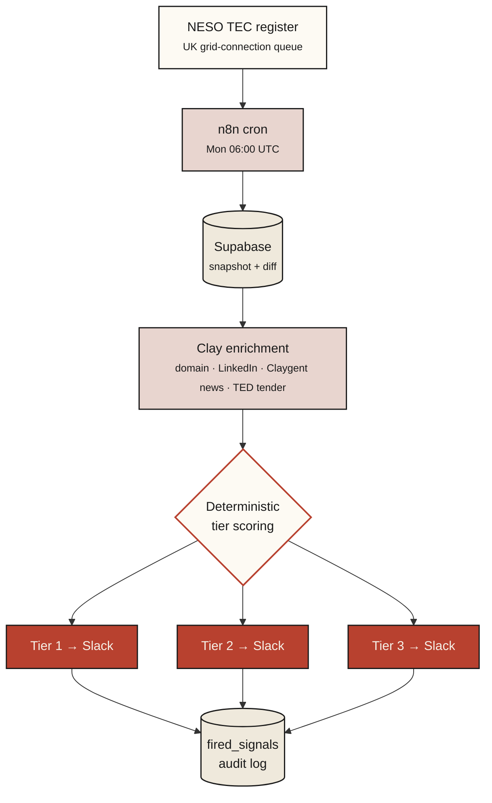
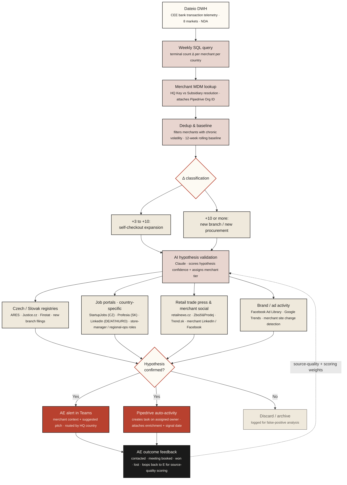
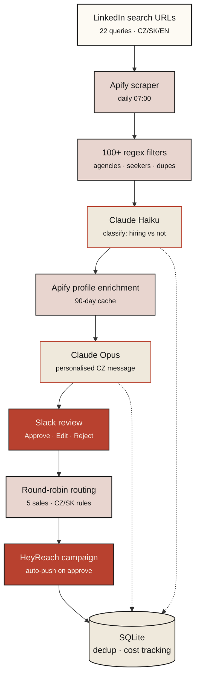
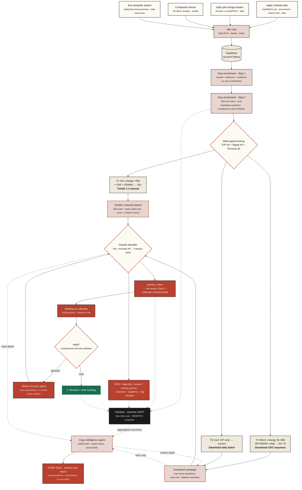
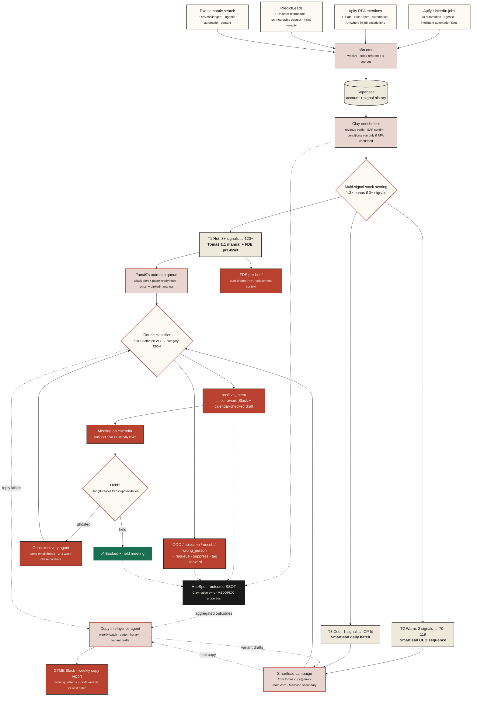
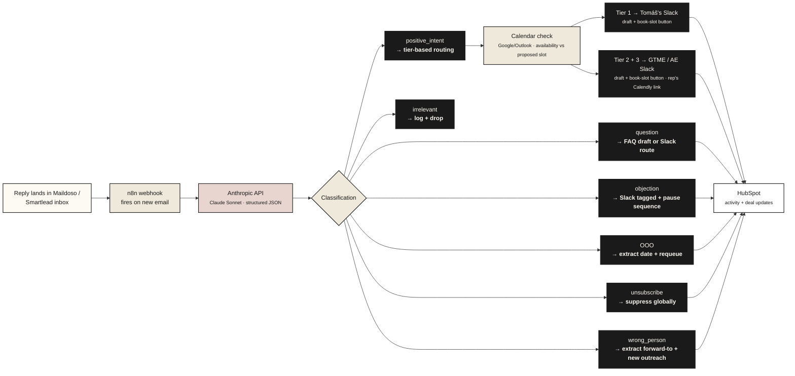

# What I shipped, and what I'd wire *first* at Duvo.

**GTM Engineer Application · For Duvo**

Jan Mikeš · 14 May 2026 · For Tomáš + David

## 90-second walkthrough

[→ Open in Loom](https://www.loom.com/share/6229b7c2f5e44a72af3861ee1ce0af93)

*90-second face-cam walkthrough. The document below is the deep dive.*

## What's in this document

1. **Parts 1–3 · Three signal pipelines I've shipped.** UK BESS for a Norwegian GTM agency · Dateio CEE retailer terminal-growth · B2B HR-tech LinkedIn hiring-post outreach. Collapsed by default in the HTML – sections fully expanded here.
2. **Part 4 · The Duvo proposal — the JD answer.** Open by default. Includes the two signals I'd wire first, six worked campaign instances across both signals × three tiers, the AI reply classifier + ghost-recovery agent, tier routing, ten internal-tooling micro-builds, rollout, and cost.

Skip ahead: [Proposal](#part-4--what-id-wire-first-at-duvo) · [Signals](#two-signals-one-founder-led-motion-ai-triaged-replies) · [Tier routing](#tier--campaign-routing) · [Internal tooling](#internal-tooling--the-leverage-compound) · [Rollout](#rollout-plan--week-1-access--warmup--week-4-both-signals-live) · [Cost](#stack-cost--7801480mo-at-pilot-scale-5001000-accounts-monitored)

---

## Part 1 · UK BESS developer signal engine `Shipped`

Shipped for a Norwegian GTM & ABM agency on behalf of their BESS-vendor client · solo build, <2 days of focused work · live Slack alerts on UK Track 1 BESS developers · open-source · [github.com/Miksh21/bess-signal-pipeline](https://github.com/Miksh21/bess-signal-pipeline)

**Built for:** a Norwegian GTM & ABM agency running outbound on behalf of their BESS-vendor client – needed to surface UK developers in the pre-tender window when buying decisions are still open. Architecture is public; client-specific scoring and account list stay private.

**Problem.** Battery Energy Storage System developers commit grid-connection capacity to the UK National Energy System Operator 2–5 years before they tender for vendor equipment. The TEC register (Transmission Entry Capacity) publishes every connection application – project, capacity, Commercial Operations Date, developer. Most vendors find these developers via news announcements, typically 6–12 months *after* the vendor decision has been made. Too late.

**Signal.** The TEC register, polled weekly. Filter: BESS technology, COD between 2027–2035. Diff against the previous week's snapshot.

*BESS pipeline · weekly cron · public data · MIT licensed*

#### Tier rules

- **Tier 1** – `news_count ≥ 2` OR (`ted_match ≥ 1` AND `news_count ≥ 1`). Developer is publicly active. Hot.
- **Tier 2** – any single positive enrichment hit. Warm.
- **Tier 3** – TEC-only, no enrichment hit. First-mover cold but defensible.

#### Real Slack output, last Monday's run

Live Slack alert recreated in HTML – every button is a real link, click to open the underlying source.

> ### Slack alert · 9:34 · 🚨 TIER 1 – ABERTHAW ENERGY LIMITED
>
> **Project capacity:** 249 MW
> **Connection date:** 2028-10-30
> **TEC project ID:** `a0l4L0000005ietQAA`
> **Confirmation score:** 2 (2 sources)
>
> **Why Tier 1:** 2 news mentions confirm active BESS development.
>
> ✏️ **Cold pitch (BMS vendor → VP Project Development):**
>
> > Saw Aberthaw Energy's 249 MW project cleared Ofgem's LDES eligibility last September – as you move into Project Assessment, BMS specs often lock in before EPC selection. Worth a 15-min benchmark from other UK Track 1 developers?
>
> 🚀 **Action:** get this in front of a contact in <24h. Sequence + LinkedIn dual-channel.
>
> **Buttons:** [🔍 NESO record](https://www.neso.energy/data-portal/transmission-entry-capacity-tec-register) · [📰 News](https://www.ofgem.gov.uk/sites/default/files/2025-09/LDES%20Eligibility%20Assessment%20Outcome.pdf) · [📂 Companies House](https://find-and-update.company-information.service.gov.uk/search?q=Aberthaw+Energy+Limited)
>
> **Sources (2):** [📰 News 1 · Ofgem LDES Eligibility](https://www.ofgem.gov.uk/sites/default/files/2025-09/LDES%20Eligibility%20Assessment%20Outcome.pdf) · [📰 News 2 · Modo Energy](https://modoenergy.com/research/en/gb-great-britain-long-duration-energy-electricity-storage-ldes-cap-floor-ofgem-eligibility-september-2025-assessment-bess)

| | |
|---|---|
| **Cost per row** | ~10 Clay credits per developer enriched |
| **Stack** | n8n (self-hosted) · Supabase free · Clay Explorer · Slack |
| **Built** | Solo, <2 days of focused work, Claude Code as daily driver |
| **Repo** | [github.com/Miksh21/bess-signal-pipeline](https://github.com/Miksh21/bess-signal-pipeline) · MIT · full README, workflow JSON, migrations, architecture doc |

---

## Part 2 · Dateio CEE retailer terminal-growth engine `In progress`

Proprietary CEE bank-transaction data moat · weekly terminal-count deltas detect merchant expansion before it hits the news · code + numbers under Dateio NDA, architecture transferable.

**Problem.** Dateio sits on a unique data moat: bank transaction telemetry across the CEE retail merchant base. Most outbound vendors find merchant expansion via news (store openings, IPOs, press releases) – months after the vendor decision. We can see the expansion in transaction data *before* it goes public.

**Hypothesis.** Weekly delta on terminal count per merchant per country:

- `+3 to +10 terminals` → branch expansion (typically self-checkout rollout, very common pattern)
- `+10 or more` → new branch opening or terminal procurement for new sites

*Dateio terminal-growth · proprietary data moat · FMCG vertical*

#### What's shipped vs designed

- **Shipped:** the weekly SQL query, terminal-delta classification logic, the merchant MDM lookup (HQ Key vs Subsidiary resolution feeding Pipedrive Org ID attachment). Running today.
- **Designed, awaiting marketing-director onboarding (Aug 2026):** the multi-source enrichment loop (registries, country-specific job portals, retail trade press, brand activity), the AI hypothesis validation, country-routed Teams alerts to AEs, Pipedrive auto-activity creation, and the AE-outcome feedback loop that re-weights source-quality scoring over time.

#### Teams adaptive card · sample format

Dateio runs on Microsoft Teams. Sample card shape for the merchant-expansion alert – bracketed values are placeholders since merchant-level deltas are under NDA.

> ### 📊 Dateio Signal Engine · posted 09:14 · Today
>
> **📈 MERCHANT EXPANSION – [Merchant name redacted]**
>
> **Country:** Czech Republic
> **Weekly Δ:** +14 terminals (vs 0–3 baseline)
> **Pattern:** New branch opening (> +10 terminals)
> **Merchant tier:** Tier 1 · top-50 CEE retail
> **Signal date:** 2026-05-12
>
> **Why it matters:** Terminal procurement of +14 in 7 days indicates a new physical store opening. Press release typically follows in 4–8 weeks. We see the procurement decision *before* the public announcement – partnership outreach lands ahead of competitors.
>
> **Buttons:** 📇 Open in CRM · 🗄️ View source query · ✅ Mark contacted

#### Why I can't show the data

The transaction telemetry is under NDA – I can't reveal merchant-level deltas. What I *can* show is the workflow and the alert shape. The moat here isn't the workflow, it's the data access. Duvo's exact parallel: Rohlik's operational telemetry was the proving ground that turned Duvo's agents into a product. Proprietary domain data > generic ICP lists, every time.

#### Why I can't run it as outbound today

Outbound at Dateio is top-down 1:1 per AE – not a campaign function. So this is infrastructure I'm building for the moment that policy shifts (planned for marketing-director onboarding, August 2026). It's the kind of patience-with-prep work that compounds inside an org over quarters.

| | |
|---|---|
| **Adjacent signals** | CDP/CRM migration tracking · brand-awareness social listening · same architecture, future sprint |

---

## Part 3 · LinkedIn hiring-post outreach pipeline `Operating`

Designed by my client's previous LeadGen hire · I operate it now as fractional GTME at a B2B HR-tech client · running in production on the client's AWS infra · the architectural pattern Part 4 borrows from.

**Context and ownership.** Pipeline designed and built by my client's previous LeadGen hire (now departed). I'm fractional GTME at the client – a B2B HR-tech company. After my predecessor left, I came in to complete deployment, run the forensic audit they couldn't deliver, and operate the system day-to-day. The pipeline runs on the client's AWS infrastructure (their IT/devops manages the deployment surface); I own the GTM logic, signal rules, message copy, AE routing, and ongoing improvements. IP belongs to the client. Including this here because the architecture is the multi-stage *signal → classify → personalise → review → push* shape Duvo's JD describes – and the proposed Duvo signals in Part 4 re-use this architectural pattern.

**Signal.** 22 LinkedIn search queries (CZ/SK/EN hiring keywords), scraped daily via Apify. ~100 posts in, ~25–30 qualified leads out.

*LinkedIn hiring-post pipeline · CZ/SK market · 583 tests · 98% coverage · MIT*

#### Slack review gate · sample alert

This is the human-in-the-loop step. Every personalised draft hits Slack for a sales-team member to approve/edit/reject before it's pushed to HeyReach. No message reaches a prospect without human eyes.

> ### 10:42 · #leadgen-review · 💼 HIRING SIGNAL – [Company name]
>
> **Role:** Senior Account Executive · DACH
> **Posted:** 2 hours ago · LinkedIn
> **Country:** 🇨🇿 Czech Republic · formal greeting (Vykání)
> **Routed to AE:** [Round-robin: AE 3 of 5]
>
> ✏️ **Personalised draft (CZ, Claude Opus):**
>
> > Dobrý den, [pane/paní Vokativ příjmení CZ/SK],
> >
> > vidím, že pro [Společnost lidově (bez s.r.o atp.)] hledá seniorní obchodníky pro DACH. Klasická inzerce dnes oslovuje hlavně aktivní uchazeče – a ti seniornější se nehlásí, protože si práci aktivně nehledají.
> >
> > U nás kombinujeme AI sourcing pasivních kandidátů s předvýběrem od seniorních recruiterů. AI voicebot odfiltruje až 90 % nerelevantních profilů ještě před tím, než vám pošleme jakýkoliv životopis. První prověření kandidáti přicházejí typicky do 48 hodin od spuštění kampaně.
> >
> > Měl(a) byste 15 minut tento týden na krátký call?
>
> **Buttons:** ✅ Approve & push to HeyReach · ✏️ Edit draft · ❌ Reject
>
> Cost this draft: $0.18 · Haiku classify $0.02 + Opus personalise $0.16

#### What stands out

- **Multi-stage AI** – Claude Haiku for cheap classification, Claude Opus only for the final personalised message. Cost-capped at $5/run.
- **Human-in-the-loop** – Slack review gate (above) before any message hits HeyReach. Approve / Edit / Reject buttons are real, not decorative.
- **4-level dedup** – cross-run author (30d), profile cache (90d), company-level, push-time. No prospect gets contacted twice.
- **Country-aware routing** – Slovak leads route to a specific AE first; formal vs informal greeting rules enforced.
- **Production posture** – 583 automated tests, 98% coverage, CI/CD on GitHub, per-run cost cap, pre-stage cost estimation.

| | |
|---|---|
| **Total cost** | ~$100–160/month all-in (Apify, OpenRouter, hosting, HeyReach) |
| **Output** | ~25–30 qualified leads/day across 5 AEs |
| **Time saved** | ~2–3 hours/day of manual LinkedIn searching |
| **Ownership** | Design: previous LeadGen hire (departed) · IP + infra: B2B HR-tech client · GTM logic + operations + ongoing development: me |

---

## Part 4 · What I'd wire first at Duvo

# Hire me as Duvo's first GTM Engineer to build the system that makes a 5-person GTM team look like 50.

Hire me as the unsung 10x hire the JD asks for. I'll ship all four ownership pillars – **agentic outbound stack, signal pipelines, account scoring & CRM hygiene, internal tooling** – live in 4 weeks, on ~$780–1,480/mo of new tool-stack spend (not headcount), with the AI classifier + copy agent running inside Duvo's existing Claude allocation. The next AE you hire lands on infrastructure, not a blank slate – pipeline for everyone, forever.

**4 JD pillars shipped in 4 weeks · 2 signal pipelines + 4-signal roadmap · 10-tool internal stack · ~$780–1,480/mo tool-stack spend · 0 new AE seat (the hire before #2)**

1. **What ships in 4 weeks — the four pillars verbatim from the JD.**
   - **(i) Agentic outbound stack.** Tier-routed multi-step sequences from Tomáš's name across all 3 tiers + his personal LinkedIn for Tier-1 manual. Sequences fire on real intent (Signal A / B trigger), not arbitrary cadences. AI classifier triages every reply with calendar-checked drafts + MEDDPICC fields auto-written to HubSpot.
   - **(ii) Signal pipelines.** Two live at Week 4: retail leadership change (Apify · Companies House · Exa) and post-RPA disillusionment (LinkedIn jobs · PredictLeads · Exa semantic). Both ingest, score, route to the right rep with the right narrative. Four-signal roadmap behind them (market expansion · vendor stack displacement · ABM saturation · M&A).
   - **(iii) Account scoring & CRM hygiene.** Clay-native HubSpot sync. ICP-40 + Signal-40 + Persona-20 scoring with recency multipliers. MEDDPICC properties auto-populated from positive replies. RB2B web visits stacking from Week 4 to bump tiered accounts. Tier-1 accounts get attention; HubSpot stays clean.
   - **(iv) Internal tooling.** Ten vibecoded micro-tools (Claude Code daily-driver). Flagship pair: AI reply classifier + self-learning copy agent (closed loop, retrains weekly). Supporting cast: pre-call research agent, HubSpot MCP server, Slack ROI calculator, Gong/Granola feedback loop, meeting action-item agent, ghost-recovery agent (catches the silent leak of ghosted meetings), weekly Tier-1 digest, Cowork dashboards. Turns 30-minute manual tasks into 30-second clicks.

   → [Signals + Campaigns](#two-signals-one-founder-led-motion-ai-triaged-replies) · [Tier routing](#tier--campaign-routing) · [Internal tooling](#internal-tooling--the-leverage-compound)

2. **Why this configuration is right for Duvo specifically.** Series A pre-AE founder-led GTM works *exactly* when Tomáš is a sitting CEO of a €1B+ CEE grocery group cold-mailing peer category managers, supply chain leads, and CFOs – his dual-CEO position across all 3 tiers compounds an asset no AE hire can ever replicate. Maildoso secondary domains protect duvo.ai reputation at any volume. Claude-native stack means classifier + copy agent run on existing Anthropic allocation, not new spend. The JD's pilots-into-annual-licences motion needs enterprise-grade qualification on every Tier-1 reply; the classifier writes MEDDPICC fields back to HubSpot before Tomáš walks into discovery. CEE retail + UK = both regions I've shipped against (Dateio B2C retail signals, BESS for a Norwegian agency, HR-tech client outbound forensics).

   → [Tier routing](#tier--campaign-routing) · [Proof-of-work in Parts 1–3 above](#part-4--what-id-wire-first-at-duvo)

3. **What it costs and when it pays back.** ~$780–1,480/mo of new tool-stack spend (HeyReach $0 at pilot, deferred to first AE hire · HG Insights not needed · Anthropic API within existing allocation). 4-week rollout: Week 1 access + Maildoso warmup, Week 2 Signal A live, Week 3 Signal B build + classifier wired, Week 4 copy agent + RB2B web visits stacked on. Pays back the first month it lands a Tier 1 pilot that converts.

   → [Cost detail](#stack-cost--7801480mo-at-pilot-scale-5001000-accounts-monitored) · [Rollout plan](#rollout-plan--week-1-access--warmup--week-4-both-signals-live)

### Two signals, one founder-led motion, AI-triaged replies

The JD names hiring posts, leadership changes, and tech-stack changes as the signal universe. Of those, leadership changes have the highest reply-rate baseline (~3× cold; peak engagement at days 14–45 – the vendor-amnesty window when most new ops leaders are still rebuilding their stack). Tech-stack changes are second when the change *names a specific competitive position* – for Duvo, that's the post-RPA pivot.

**The leverage thesis, made operational.** The JD frames the role as "hire before a second AE" because a GTM Engineer produces pipeline for everyone, forever. At Series A pre-AE-hire stage, the right motion is founder-led: Tomáš's name on every email, his personal LinkedIn for Tier 1 manual touches, and a Claude-based reply classifier as the operational layer that scales his calendar. The internal tooling layer (further down) compounds that: every dashboard, Slack bot, and Claude Code micro-tool turns 30-minute tasks into 30-second clicks. When Duvo hires the first AE, the system absorbs them as a new routing target without rewiring – the AE picks up most Tier 1 accounts using HeyReach on *their own* personal LinkedIn (high-touch channel for high-priority accounts, the place LinkedIn automation belongs); Tomáš retains a small peer-CEO subset of Tier 1 manually; Tier 2 + 3 stay email-only at every phase. Tomáš's personal LinkedIn is never automated.

Two signals, each picked to feed both territories Duvo plans to cover – CEE and UK:

### Signal A · Retail/FMCG leadership-change tracker `Proposed`

**Why now.** Duvo's named buyer is the operational leader at multi-billion-dollar retail and FMCG groups – Heads of Operations, Procurement, Category Management, Finance Ops. The 14–45 day window post-hire is the vendor-amnesty window: peak openness to net-new tools, before the calendar fills with maintenance work. Most outbound finds these leaders 6–12 months later when budgets are locked. This catches them at maximum receptivity.

Rohlik – Duvo's public customer – is a CEE retailer operating across Czech Republic, Germany, Hungary, Austria, Romania. The pattern is proven there. CEE + UK both need a feeder that respects HQ-country routing so Tier 1 manual outreach (and the future AE's territory) doesn't get tangled.

| | |
|---|---|
| **Lead time** | 14–45 day vendor-amnesty window post-hire |
| **Geography** | CEE · UK (one founder-led queue today, both AE territories tomorrow) |
| **Sources, free** | Apify LinkedIn jobs scrape (Director+ retail/FMCG ops/procurement/finance titles) · Apify LinkedIn job-change tracking · Companies House officer changes (UK) · **Exa semantic search** for leadership announcements and retail-trade press mentions (better than fixed RSS, picks up coverage Apify misses) |
| **Sources, paid** | Apollo for contact-data coverage (named in JD, complements Clay waterfalls) · PredictLeads for hiring-velocity layer |
| **Scoring** | ICP fit (40) + signal strength (40) + persona authority (20) = max 100. Recency multipliers applied to weight fresh signals. |
| **Scraping spine** | Same Apify + n8n + Supabase + Slack architecture as Part 3. Retarget existing actors via config change, not rebuild. |

*Retail leadership-change tracker · two-territory routing · CRM auto-sync runs in parallel · CRM is the system of record, Slack is the trigger*

#### Slack alert · Tier 1 sample

> ### 07:14 · #signal-a-leadership-changes · 🔥 TIER 1 – [ACCOUNT NAME]
>
> **Persona:** [First Last] · [Head of Procurement]
> **Days in role:** 12 · vendor-amnesty window open
> **Account:** €[X.X]B · retail/FMCG · SAP S/4HANA
> **Score:** `87 / 100`
>
> ✏️ **Suggested hook (1:1 manual):**
>
> > Saw you joined [Account] as [Head of Procurement] [12 days] ago. The first 90 days are usually when new ops leaders inherit the manual-process pile nobody had time to fix. Rohlik freed ~60 FTE on supplier negotiations alone with Duvo's agents. Worth 20 minutes?
>
> **Buttons:** 📇 Open in HubSpot · ⭐ Add to dream list · 💼 LinkedIn profile

### Signal B · Post-RPA disillusionment signal `Proposed`

**Why now.** Duvo's CEO interviews and the SAP-Build-vs-Agentic-AI blog post position the company explicitly as the post-RPA layer – "agents for the messy middle that judgment-based work that breaks UiPath." Every retailer/FMCG with €500M+ revenue deployed UiPath, Blue Prism, or Automation Anywhere between 2018 and 2023. By 2026 those deployments are aging, restructuring, and quietly being modernised. The signal is Duvo's pitch made operational: find accounts where the RPA reckoning is happening, route them to the AE before the modernisation budget gets spent elsewhere.

Forward Deployed Engineers (US + EU, two open roles per the careers page) are positioned for the technical-replacement conversation. This signal feeds them pre-qualified accounts where the conversation is already ripe.

| | |
|---|---|
| **Lead time** | Real-time + 90-day lookback on tech-stack events |
| **Geography** | Both regions (CEE + UK) · stacked-signal qualification |
| **Sources, free** | Apify LinkedIn jobs scrape (AI automation / agentic / intelligent automation titles) · Apify scrape for legacy RPA tool mentions (UiPath / Blue Prism / Automation Anywhere) in job descriptions · **Exa semantic search** for retail/FMCG content discussing RPA challenges, agentic automation, legacy modernisation |
| **Sources, paid** | PredictLeads for technographic dataset, RPA team restructure events, and hiring velocity – replaces HG Insights at pilot scale (HG only justified later if Fortune-500 displacement plays come into scope) |
| **Multi-signal stack** | 3 stacked signals (RPA installed + AI hire + revenue match) trigger a 1.3× heat bonus → Hot tier |
| **Operating principle** | Don't lead with "your UiPath is broken" – lead with the workflow Duvo solves. The signal is internal targeting, not the email opener. |

*Post-RPA disillusionment signal · stacked-source qualification · CRM auto-sync runs in parallel · FDE pre-brief on Hot accounts*

#### Slack alert · Hot tier sample (3-signal stack)

> ### 07:14 · #signal-b-post-rpa · 🔥 HOT – [ACCOUNT NAME]
>
> **Account:** €[X.X]B · retail/FMCG
> **RPA stack:** UiPath since [2020] · headcount −18% last 90d
> **AI hire:** "AI Automation Lead" · posted [4 days] ago
> **Score:** `124 / 130` · 3-signal stack × 1.3×
>
> ✏️ **Suggested hook (1:1 manual):**
>
> > Teams in retail with a legacy UiPath deployment hit the same wall: bots break the moment the process needs judgment. Duvo's agents navigate supplier portals, SAP screens, and approval emails without rule-based logic. We don't replace UiPath; we handle what UiPath couldn't. Worth a quick conversation?
>
> **Buttons:** 📇 Open in HubSpot · 📄 FDE pre-brief · 🔍 PredictLeads tech stack

### Roadmap – four more signal types behind the pilot

Signals A + B prove the model in Duvo's domain. The four below come next, ported from the *Situation → Insight → Action* framework I work with at Dateio – same Apify + Clay + n8n + Slack spine, new configs and scoring logic, no new infrastructure. The system gets *denser*, not bigger.

#### 01 / 04 · Month 2 · Market expansion event

*Dateio analog: "New store opens"*

| | |
|---|---|
| **Situation** | ICP retailer announces new market entry, subsidiary acquisition, or distribution-center launch. *Source: Apify PR scrape · Companies House · PredictLeads financing events* |
| **Insight** | Operational complexity spike = automation budget. Existing process playbooks don't scale to the new entity. Most reachable in the first 60 days post-announcement. |
| **Action** | **Tier 1 Hot.** Tomáš (or future AE) 1:1 cold-open with the Rohlik CZ→DE→HU→AT→RO comparable. FDE pre-brief on transformation cost before the call. |

#### 02 / 04 · Month 3 · Competitor evaluation window

*Dateio analog: "Competitor opens nearby"*

| | |
|---|---|
| **Situation** | UiPath / SAP Build / Workato product launches or major releases land in TAM accounts. *Source: PredictLeads news · Exa semantic search · vendor press release scrape* |
| **Insight** | Buyer is already in automation-evaluation mode. 30-day window before vendor decision locks. Most addressable when the first vendor disappoints in POC. |
| **Action** | **Tier 2 Warm.** Smartlead CEO sequence from Tomáš in the 30-day window. "We handle what they couldn't" angle. Email-only at every phase – no LinkedIn layer at this tier (HeyReach is reserved for the AE's Tier 1 LinkedIn channel, post-AE-hire). |

#### 03 / 04 · Month 3–4 · Automation team contraction

*Dateio analog: "Footfall drops"*

| | |
|---|---|
| **Situation** | RPA-adjacent hiring goes silent for 90+ days after a period of active job postings. *Source: PredictLeads hiring velocity · Apify LinkedIn jobs diff · headcount tracking* |
| **Insight** | Either understaffed (Duvo as augmentation) or quiet vendor swap underway (Duvo as replacement). Both reachable but require different framing. |
| **Action** | **Tier 2 Warm.** HeyReach to remaining team members. "Augmentation, not replacement" framing primary; "vendor evaluation underway?" as secondary. |

#### 04 / 04 · Month 4 · Precision stack-displacement

*Dateio analog: "Market-share target"*

| | |
|---|---|
| **Situation** | Tier 1 ICP × verified RPA installed base × AI-role hiring activity, qualified as Signal B Hot at full production cadence. *Source: Signal B Hot tier · ABM ad audience overlay · CRM control-group flag* |
| **Insight** | These accounts are simultaneously highest-fit and most defended. Single-channel outbound is insufficient – needs multi-touch ABM with a control group to measure incrementality vs blind outbound. |
| **Action** | **Tier 1 Hot.** Tomáš (or future AE) 1:1 + ABM ad audience overlay. Control-group hold-out for true incrementality measurement. |

**The framework is portable.** What I built at Dateio for B2C retail signals – the architecture that turns DWH events into tier-routed campaigns – is the same architecture above, retargeted. The two pilot signals prove the model; the four above are what compounds in months 2–4. Same spine, new configs.

---

## Campaigns – signals, outreach, AI-triaged replies

Six worked instances across both pilot signals × three tiers. Tomáš from-name on every email (Maildoso secondary domain). Tier 1 LinkedIn from his personal account (manual only). All replies triaged by a Claude-based classifier before they ever hit a human – positive intent surfaces to Slack within seconds with a paste-ready draft.

The architecture above answers *which* accounts to engage and *when*. This section answers *how*. Three architectural choices drive the entire outreach surface:

1. **All email from Tomáš Čupr.** At Series A pre-AE-hire stage, founder-led sales is the dominant motion in CEE retail. **Tomáš's dual role as sitting CEO of Rohlik Group and Founder/CEO of Duvo is the strongest single GTM asset Duvo has** – a current CEO of a €1B+ CEE grocery group cold-mailing peer operators carries weight no AE pitch can ever replicate. Using his name across all three tiers compounds that value. Sent via warmed Maildoso secondary domains (`tomas.cupr@duvo-team.com`) so primary `@duvo.ai` inbox reputation stays clean regardless of volume.
2. **Tier 1 LinkedIn = Tomáš's personal account, manual only.** ~5–15 DMs/week, sent by him. Reserved for Hot Tier 1 accounts. No HeyReach automation on his account – ever. LinkedIn is irreplaceable infrastructure and a single account ban erases the founder-channel advantage. Tier 2/3 run as email-only via the CEO from-name at every phase. Once Duvo hires the first AE, the AE's personal LinkedIn becomes the HeyReach engine for the AE's portion of Tier 1 accounts (LinkedIn automation belongs on the high-touch tier, not the high-volume tiers); Tomáš retains a peer-CEO subset of Tier 1 manually.
3. **All replies triaged by a Claude-based classifier.** Every inbound – from any tier, any channel – hits an n8n workflow that calls the Anthropic API with structured JSON output. Classification into `positive_intent · question · objection · OOO · unsubscribe · wrong_person · irrelevant`. Each branch routes differently. **Positive intent is routed by tier:** Tier 1 surfaces to Tomáš's Slack within seconds with a paste-ready draft and an availability-checked meeting slot; Tier 2 + Tier 3 surface to the GTME's Slack (mine, during pilot) or to the AE's Slack once one is hired – each with their own Calendly link. The AI never replies *as* the rep – it triages, drafts, cross-checks calendars, and waits.

The six instances below show the full surface: two signals × three tiers, with alert cards matching what Tomáš sees in Slack, then the email and LinkedIn copy that fires from each. Tier 1 instances have three parallel variant hooks (A / B / C – any can be picked); Tier 2 and 3 instances show the 3-step sequence (Step 1 A, Step 1 B, Step 2 bump or Step 4 value drop).

### Six worked instances · Signal A and Signal B × T1 / T2 / T3

#### Instance 1 · Signal A · Tier 1 Hot · Bea Bach

> ### Slack alert · duvo-signals · Today at 09:14
>
> **Title:** Bea Bach landed at Tesco HU as CCO · 14 days in role
>
> **Account:** Tesco Stores ČR a.s. (Tesco Hungary subsidiary)
> **Revenue:** €8.2B group · grocery + non-food
> **Stack:** SAP S/4HANA · 8 CEE markets
> **Tier signals:** Leadership change (14d) + vendor amnesty window + ICP fit
> **Score:** 92 / 100
>
> **Routing:** Tomáš's manual outreach queue. Email from tomas.cupr@duvo-team.com + DM from his personal LinkedIn. Replies → Claude classifier → instant Slack ping.
>
> **Hook context:** Rohlik solved this exact SAP-to-supplier handoff pattern during the CZ→HU expansion. The 90-day playbook is Tomáš's strongest cold open at Tier 1.

**Email · Variant A · Pattern recognition**

> **From:** Tomáš Čupr <tomas.cupr@duvo-team.com> · **To:** Bea Bach · Tue 12/05/2026 10:42
> **Subject:** Tesco HU + the SAP-to-supplier gap
>
> Hi Bea,
>
> Saw the news – congrats on the Tesco HU role. Most new CCOs at this scale inherit a supplier-portal automation backlog that was "good enough" for the previous footprint and breaks at the new one. Rohlik hit this exact wall in the CZ→HU expansion.
>
> Happy to walk through what we fixed in 90 days. Worth 15 min next week?
>
> Tomáš

**Email · Variant B · Specific pain**

> **Subject:** SAP S/4HANA → supplier handoff across 8 markets
>
> Hi Bea,
>
> Quick context – at Rohlik we ran into a specific failure mode during the CEE expansion: the supplier-portal logic that worked at single-market scale started silently dropping handoffs once SAP was orchestrating across 8 markets. Took 90 days and a parallel agent layer to fix.
>
> If Tesco HU is at the early signs of this with the S/4HANA rollout, worth a 15-min comparison before the patterns lock in?
>
> Tomáš

**Email · Variant C · Quiet question**

> **Subject:** Quick one
>
> Bea,
>
> Quick one, no pitch. How is the SAP rollout playing with the existing supplier portal? Curious where Tesco HU is on the curve.
>
> Tomáš

**LinkedIn DM · Variant A · Direct peer-to-peer** *(Connection request + first DM)*

> **Tomáš Čupr** · Founder & CEO at Duvo · CEO at Rohlik Group · Tue 09:18
>
> Hi Bea, congrats on the Tesco HU role. I'm CEO at Rohlik and Duvo – we hit the same supplier-portal handoff break during Rohlik's CZ→HU expansion. Curious if you're seeing the same patterns yet, or if S/4HANA is masking them. Happy to share what we did – 15 min?

**LinkedIn DM · Variant B · Pattern recognition**

> Bea – congrats on the new role. New CCOs at multi-market grocery scale usually inherit a supplier-portal automation backlog from the previous footprint that breaks at the new one. Rohlik hit this; we built an agent layer over it. If useful, happy to walk you through what worked.

**LinkedIn DM · Variant C · Specific pain**

> Bea, hi – quick context: during Rohlik's CEE expansion the SAP-to-supplier handoff started dropping items silently once we crossed 4 markets. If Tesco HU is anywhere near that curve, worth a 15-min call before the patterns lock in.

#### Instance 2 · Signal A · Tier 2 Warm · Andrei Bucur

> ### Slack alert · duvo-signals · Today at 11:02
>
> **Title:** Andrei Bucur landed at Carrefour Romania as Country Manager · 42 days in role
>
> **Account:** Carrefour România SA (incl. Moldova)
> **Revenue:** €1.8B local · grocery + non-food
> **Stack:** Oracle EBS · 2 markets (RO + MD)
> **Tier signals:** Leadership change (past amnesty) + €1B+ revenue + ICP fit
> **Score:** 68 / 100
>
> **Routing:** Tier 2 sequence launching automatically. 3-step email from tomas.cupr@duvo-team.com via Maildoso. No LinkedIn layer (Tomáš's account reserved for Tier 1 manual). All replies → Claude classifier → routing.
>
> **Hook context:** 42 days in is past the primary amnesty window – this is a Tier 2 enrolment, not a Tomáš manual touch. Auto-enrolled in CEO email sequence.

**Email · Step 1 · A · Austin-style direct**

> **From:** Tomáš Čupr <tomas.cupr@duvo-team.com> · **To:** Andrei Bucur · Tue 12/05/2026 09:14
> **Subject:** Quick one for Carrefour RO
>
> Andrei,
>
> We haven't met. I'm CEO at Rohlik and Duvo – Rohlik is a grocery competitor of yours across CEE (direct in CZ and HU), Duvo builds agent infrastructure for retailers at the Oracle-EBS-mature stage.
>
> Most country managers at €1.5B+ grocery scale on legacy Oracle EBS hit a specific automation ceiling around 36 months in. If that's where Carrefour RO is, worth a comparison call. If not, just reply "no" and I'll close the loop.
>
> Tomáš

**Email · Step 1 · B · Peer-to-peer**

> **Subject:** Oracle EBS at the 36-month mark
>
> Hi Andrei,
>
> Tomáš here from Duvo (also CEO at Rohlik – we're a direct grocery competitor in CEE).
>
> Carrefour RO + MD on Oracle EBS is right in the zone where most peers hit an automation ceiling – the modifications stack hits a complexity wall and IT can't ship faster. We've been quietly working with two grocery groups at the same stage. 15-min comparison call?
>
> Tomáš

**Email · Step 2 · Bump (Day 5)**

> **Subject:** Re: Quick one for Carrefour RO · Mon 18/05/2026 08:30
>
> Andrei – following up on the note below.
>
> Even a "not now" is useful – if it's the wrong time, I won't reach back out.
>
> Tomáš

**LinkedIn:** *No LinkedIn layer at this tier – at any phase.* Tomáš's personal LinkedIn account is reserved exclusively for Tier 1 Hot manual outreach (~5–15 DMs/week, sent by him). Putting HeyReach automation on his account at any volume would burn the only founder-LinkedIn asset we have. Once Duvo hires the first AE, the AE's personal LinkedIn becomes the HeyReach engine for the AE's portion of *Tier 1* – not Tier 2/3. LinkedIn automation belongs on the high-touch tier where reply rates justify it; Tier 2 + 3 stay email-only via the CEO from-name at every phase.

#### Instance 3 · Signal A · Tier 3 Cool · Daily batch CEE

> ### Slack alert · duvo-signals · Today at 07:00
>
> **Title:** Tier 3 daily batch · 17 leadership changes (avg score 38 / 100)
>
> **Batch size:** 17 accounts across CEE + UK retail
> **Filter:** ICP-fit only · no recency or stack precision
> **Stack:** Mixed · Oracle EBS, SAP ECC, NetSuite, JDA
> **Tier signals:** Single trigger (leadership change) · no stacking
> **Score:** 38 / 100
>
> **Routing:** Smartlead daily batch from tomas.cupr@duvo-team.com (warmed Maildoso secondary). All replies → Claude classifier → positive intent escalates to Tomáš's manual queue.
>
> **Batch summary:** Logged to #tier-3-nurture-log. Smartlead picks up tomorrow's send window. No human touch required – the system handles enrolment, send, and reply triage.

**Email · Step 1 · A · Direct question**

> **From:** Tomáš Čupr <tomas.cupr@duvo-team.com> · **To:** {first_name} {last_name} · Wed 13/05/2026 09:00
> **Subject:** How is Oracle EBS playing right now?
>
> Hi {first_name},
>
> Tomáš here from Duvo. Quick question – at {company} on Oracle EBS, how is the automation backlog playing right now? Most retailers at your scale tell me the modifications stack hits a complexity ceiling around the 36-month mark.
>
> 15-min comparison call?
>
> Tomáš

**Email · Step 1 · B · Pattern share**

> **Subject:** A pattern across {country} retail ops
>
> Hi {first_name},
>
> We've been comparing notes across grocery ops in {region}. A pattern keeps coming up: the SAP-to-supplier handoff starts dropping items silently around the 36-month mark.
>
> If that's where {company} is, worth a quick call to compare what we're seeing.
>
> Tomáš

**Email · Step 4 · Value drop (Day 14)**

> **Subject:** One last share · Wed 27/05/2026 09:00
>
> Hi {first_name},
>
> One last share – we published a short piece on the agent-augmentation pattern we used at Rohlik to keep the Oracle stack alive while shipping faster (link in my LinkedIn profile).
>
> If it's useful, take it. If not, no worries – I won't reach back out.
>
> Tomáš

**LinkedIn:** *No LinkedIn layer at this tier – at any phase.* Same rationale as Instance 2.

#### Instance 4 · Signal B · Tier 1 Hot · James Quincey / Tesco PLC

> ### Slack alert · duvo-signals · Today at 14:38
>
> **Title:** Tesco PLC · 3-stacked signals · CDO James Quincey publicly committed to AI rollout
>
> **Account:** Tesco PLC (UK + Ireland)
> **Revenue:** £61B group · grocery + general merchandise
> **Stack:** UiPath + Blue Prism (verified) · M365
> **Tier signals:** Public AI commitment + RPA installed + 8 AI hires last 90d
> **Score:** 94 / 100
>
> **Routing:** Tomáš's manual outreach queue. Email from tomas.cupr@duvo-team.com + LinkedIn DM from his personal account. FDE pre-brief auto-attached. Replies → Claude classifier → instant Slack ping.
>
> **Hook context:** 3 signals stacked = 1.3× score bonus pushes past 90. Post-RPA augmentation pattern. FDE pre-brief auto-drafts in Google Doc once Tomáš accepts the alert.

**Email · Variant A · Post-RPA precision**

> **From:** Tomáš Čupr <tomas.cupr@duvo-team.com> · **To:** James Quincey · Tue 12/05/2026 15:08
> **Subject:** Tesco's UiPath + Blue Prism stack – the augmentation path
>
> Hi James,
>
> Noticed Tesco is hiring 8 AI engineers while still running UiPath + Blue Prism at scale. Most retailers that hit that combination are 18–24 months past the point where the original RPA scope made sense – looking for the augmentation-not-replacement path.
>
> One of our FDEs has walked Tesco-comparable retailers through this exact transition. 30 min worth your time?
>
> Tomáš

**Email · Variant B · FDE pre-brief offer**

> **Subject:** Pre-brief on the post-RPA pattern
>
> Hi James,
>
> Heard Tesco has 8 open AI engineering roles. We've seen this combination of public commitment + RPA-installed-base before, and the augmentation path is non-obvious.
>
> Happy to send our FDE in for a 30-min pre-brief on what worked at peer retailers. No deck, no pitch – just the pattern. If useful, we go from there.
>
> Tomáš

**Email · Variant C · Direct question**

> **Subject:** Question
>
> James – quick one.
>
> With the AI hiring spree, is the plan to augment the existing UiPath + Blue Prism stack with agents, or rebuild from scratch? Curious which path Tesco is on.
>
> Tomáš

**LinkedIn DM · Variant A · Direct DM** *(Connection request + first DM)*

> **Tomáš Čupr** · Founder & CEO at Duvo · CEO at Rohlik Group · Tue 09:18
>
> James – noticed Tesco is hiring 8 AI engineers while still running UiPath + Blue Prism at scale. The augmentation path here is non-obvious. One of our FDEs has walked peer retailers through this transition. 30 min?

**LinkedIn DM · Variant B · FDE pre-brief**

> James, hi – we've seen the public AI commitment + RPA-installed-base combination at three other retailers. Happy to send our FDE for a 30-min pre-brief on what worked. No pitch, just the pattern.

**LinkedIn DM · Variant C · Tactical question**

> James – quick tactical one. With the 8 AI engineer roles open, is Tesco planning to augment the existing UiPath + Blue Prism stack with agents, or rebuild from scratch?

#### Instance 5 · Signal B · Tier 2 Warm · Sainsbury's UK

> ### Slack alert · duvo-signals · Today at 13:22
>
> **Title:** Sainsbury's PLC · Simon Roberts CEO + 12 automation roles open
>
> **Account:** J Sainsbury PLC (UK)
> **Revenue:** £32.7B group · grocery + Argos
> **Stack:** UiPath (verified) · multi-cloud
> **Tier signals:** Public AI commitment + 12 open automation roles · no RPA-age precision
> **Score:** 71 / 100
>
> **Routing:** Tier 2 sequence launching. 3-step email from tomas.cupr@duvo-team.com via Maildoso. No LinkedIn layer (Tomáš's account reserved for Tier 1). All replies → Claude classifier → routing.
>
> **Hook context:** 2 signals stacked, no RPA-age precision filter. Tier 2 enrolment, not Tier 1 manual. Auto-enrolled in CEO email sequence.

**Email · Step 1 · A · Austin-style direct**

> **From:** Tomáš Čupr <tomas.cupr@duvo-team.com> · **To:** Simon Roberts · Tue 12/05/2026 09:14
> **Subject:** Sainsbury's automation – the 12-role question
>
> Simon,
>
> We haven't met. Tomáš here from Duvo (I'm also CEO at Rohlik Group) – Duvo builds agent infrastructure for grocery ops at the UiPath-mature stage.
>
> Saw Sainsbury's has 12 automation roles open alongside the public AI commitment. The augmentation path at this stage is non-obvious – worth a 30-min compare? If not, just reply "no" and I'll close it.
>
> Tomáš

**Email · Step 1 · B · Peer-to-peer**

> **Subject:** Sainsbury's + the augmentation question
>
> Hi Simon,
>
> Tomáš here from Duvo (also CEO at Rohlik Group). Sainsbury's automation hiring spree caught our attention – this is the same configuration where peer retailers have ended up rebuilding from scratch unnecessarily.
>
> 30 min on what worked at others?
>
> Tomáš

**Email · Step 2 · Bump (Day 5)**

> **Subject:** Re: Sainsbury's automation · Mon 18/05/2026 08:30
>
> Simon – nudge on the below.
>
> If now's the wrong time, just say – I won't reach back out.
>
> Tomáš

**LinkedIn:** *No LinkedIn layer at this tier – at any phase.* Same rationale as Instance 2.

#### Instance 6 · Signal B · Tier 3 Cool · Auchan FR (daily batch)

> ### Slack alert · duvo-signals · Today at 07:00
>
> **Title:** Tier 3 daily batch · 23 public AI commitments (avg score 44 / 100)
>
> **Batch size:** 23 accounts across UK + DACH + FR retail
> **Filter:** ICP fit + public AI commitment · no stack confirmation
> **Stack:** Mixed · UiPath, Automation Anywhere, Power Automate
> **Tier signals:** Single trigger (public commitment) · no stacking
> **Score:** 44 / 100
>
> **Routing:** Smartlead daily batch from tomas.cupr@duvo-team.com (warmed Maildoso secondary). Replies → Claude classifier → positive intent escalates to Tomáš's manual queue.
>
> **Batch summary:** Logged to #tier-3-nurture-log. Smartlead picks up the send tomorrow. No human touch required.

**Email · Step 1 · A · Direct question**

> **From:** Tomáš Čupr <tomas.cupr@duvo-team.com> · **To:** {first_name} {last_name} · Wed 13/05/2026 09:00
> **Subject:** The post-RPA augmentation question
>
> Hi {first_name},
>
> Tomáš here from Duvo. Quick one – {company}'s public AI commitment caught our attention. The augmentation path at this stage is non-obvious.
>
> 30-min comparison call?
>
> Tomáš

**Email · Step 1 · B · Pattern share**

> **Subject:** A pattern across {country} retail ops
>
> Hi {first_name},
>
> A pattern keeps coming up across {country} retail – public AI commitment + UiPath-installed-base + active hiring. Most peers end up rebuilding when augmentation would have worked.
>
> Worth a quick compare?
>
> Tomáš

**Email · Step 4 · Value drop (Day 14)**

> **Subject:** One last share · Wed 27/05/2026 09:00
>
> {first_name},
>
> One last share – we published a short piece on the agent-augmentation pattern that worked at peer retailers (link in my LinkedIn profile).
>
> If useful, take it. If not, no worries, I won't reach back out.
>
> Tomáš

**LinkedIn:** *No LinkedIn layer at this tier – at any phase.* Same rationale as Instance 2.

### The AI reply classifier – every inbound triaged before a human sees it

The classifier is the GTM Engineer's most valuable build at Duvo, and the part of the architecture that makes the founder-led motion scale past Tomáš's calendar. It's a single n8n workflow with ~6 nodes: webhook listener on the Maildoso / Smartlead inbox → Anthropic API call (Claude Sonnet, structured JSON output enforcing the classification schema) → branching router → action per category.

**Critical framing:** the agent classifies and routes; it never replies *as* the rep. The trust the founder-led motion depends on is the human at the other end of the reply, not an autoresponder. The system buys speed (Slack ping in under 60 seconds), consistency (every reply categorized the same way), and calendar-awareness (when the prospect proposes a time, the classifier cross-checks the rep's Google/Outlook calendar before drafting). The human spends their time on the 1-in-5 replies that actually deserve them.

**Routing rule for positive_intent** – the only category where rep identity matters. Tier 1 routes to **Tomáš's Slack queue** (he keeps first look on Hot accounts). Tier 2 + Tier 3 route to the **GTME's Slack** during pilot (Jan), then to the **AE's Slack** once Duvo hires the first one – with the option for Tomáš to take any Tier 1 personally regardless of how he wants the day-to-day to run. Each rep's Calendly link is parameterised per route; the classifier picks the right link based on who got the ping.

Here is what a positive-intent classification looks like when it surfaces in Slack:

> ### Slack alert · duvo-ai-classifier · Reply detected · 22s ago · #tomas-replies
>
> **Title:** Bea Bach replied positively to "Tesco HU + the SAP-to-supplier gap"
>
> **Classification:** `positive_intent` · confidence 0.94
> **Signal · routing:** Signal A · Tier 1 Hot · day 2 after first touch → **Tomáš's queue**
> **What she said:** *"Tomáš – yes, this is exactly the gap we're working through right now. Wednesday or Thursday next week, ideally 30 min."*
> **Availability match · Tomáš's calendar:** `match` Thu 21 May · 14:00–14:30 CET (her stated preference) · also free: Wed 09:00, Thu 11:30, Thu 16:00
>
> **Paste-ready draft reply:**
>
> > Bea – great. Thursday 21st at 14:00 CET works on my side. Sending a calendar invite now: calendly.com/tomas-cupr/30min.
> >
> > Attaching the 90-day playbook from the Rohlik HU launch as pre-read – the supplier-portal section starts on page 4.
> >
> > Talk Thursday,
> > Tomáš
>
> **Buttons:** Book Thu 14:00 CET 📅 · Edit reply & send · Open thread in Gmail · Wrong classification
>
> **Book and send are separate actions.** The slot books on Tomáš's calendar (+ sends the invite to Bea) the instant he hits the primary button, even if the draft reply still needs editing – avoids losing the slot while the email gets cleaned up. If Tomáš wants to propose a different time, the secondary button opens the draft for edit before send.

Build cost: ~$5–20/month in Anthropic API spend at pilot volumes (50–200 inbound replies/month at Sonnet pricing). At Duvo's existing Claude API allocation this is functionally zero incremental cost. Build time: 2–3 days inside n8n, including the FAQ knowledge base for question-classification routing. This is the system that future-proofs the sales motion: when Duvo hires the first AE and they start sending from their own from-name, the classifier already exists and just adds them as a new routing target.

> **Closes the loop with a self-learning copy agent.** Every label the classifier writes – `positive_intent`, `objection`, `irrelevant` – is a row in a Supabase performance table linked back to the exact subject line, hook, framework, and CTA that fired it. A second weekly-cadence agent (see Internal Tooling below) reads that table, asks Claude which patterns correlate with booked meetings, and writes the next batch's variant copy. **Reply triage and copy generation are the same system viewed from two ends** – the classifier labels what works, the copy agent writes more of what works. The longer it runs, the better it gets at writing cold email, with no manual prompt engineering after Day 1.

**One inside-reference note for context:** David Cervinka surfaces in this architecture as the AE Duvo hires once Tomáš's calendar fills and the pilot proves out – at that point, the classifier routes Tier 2 + Tier 3 positive intent to him by default, with Tomáš retaining first-look on Tier 1. The system is built to absorb that transition without rewiring anything.

---

## Tier → campaign routing

One feed, three motions, one reply handler. Tier doesn't just set alert priority – it picks which tool the account flows into and which channels Tomáš's name appears across. The classifier handles every reply uniformly, regardless of which tier or channel it came from.

| Tier | Heat | Treatment | Tools |
|---|---|---|---|
| **Tier 1 + dream list** | Hot / Red Hot | 1:1 manual by Tomáš · email + LinkedIn DM from his personal account · custom drafts · FDE pre-brief auto-attached | HubSpot task + Slack alert with paste-ready hook · LinkedIn manual |
| **Tier 2** | Warm | 3-step email sequence from Tomáš via Maildoso · no LinkedIn layer (Tomáš's account reserved for Tier 1) | Smartlead campaign · Clay webhook auto-enrols account on tier assignment |
| **Tier 3** | Cool | 4-step email sequence from Tomáš via Maildoso · daily batch enrolment · low-touch nurture | Smartlead campaign · Clay webhook auto-enrols account on tier assignment |

Each tier-to-tool route is a Clay action wired to the scoring output. **Tier 1 is the only tier with a human in the send loop:** the Slack alert lands in Tomáš's queue with a paste-ready hook (3 variants ranked by signal stack), a one-click HubSpot task, and – when the signal stack qualifies – a Google Doc FDE pre-brief auto-drafted in the background. Tomáš picks email or LinkedIn (or both), edits the hook, sends from his real accounts. **Tier 2 + Tier 3 are fully automated outbound:** the Clay webhook pushes the account into a Smartlead sequence the moment the tier is assigned. Both tiers send from `tomas.cupr@duvo-team.com` on warmed Maildoso secondary domains – the founder name carries CEE retail recognition while the secondary domain protects `@duvo.ai` inbox reputation regardless of volume.

**Every reply – from any tier, any channel – passes through the Claude-based classifier before a human sees it.** The n8n workflow detailed in the Campaigns section above receives the inbound webhook from Maildoso/Smartlead, calls the Anthropic API with structured JSON output (Claude Sonnet enforcing the 7-category schema), and routes accordingly. `positive_intent` is the only category where rep identity matters – **Tier 1 routes to Tomáš's Slack**, **Tier 2 + 3 route to the GTME's Slack during pilot (Jan) and to the AE's once hired.** Whichever rep gets the ping, the classifier also cross-checks their Google or Outlook calendar against any time the prospect proposed, then surfaces an availability match and a one-click book-slot button alongside the editable draft. `OOO` extracts the return date and requeues the contact; `objection` tags the conversation and pauses the sequence; `unsubscribe` propagates globally across Smartlead, HeyReach (when added), and HubSpot; `wrong_person` extracts the forward-to contact and queues new outreach. The classifier *never* replies as the rep – it triages, drafts, books, and hands off. **After the meeting hits the calendar, the ghost-recovery agent (Internal Tooling below) takes over the held-check via Gong/Granola**; ghosted meetings re-enter the original email thread on a 2–3 week recovery cadence, held meetings register as the `booked + held meeting` terminal that the Signal A/B diagrams end on. One canonical funnel, end-to-end.

**Attribution lives in HubSpot Marketing Events by default.** Every action – Slack alert clicked, Tomáš's LinkedIn DM sent, Smartlead reply received, meeting booked, classifier categorization – emits an event to HubSpot for unified multi-touch attribution across all three tiers. The Supabase signal store (already in the pilot stack at $0) doubles as the fallback for custom attribution analytics when HubSpot's model isn't enough – control-group hold-out measurement for the precision stack-displacement signal in the roadmap is the cleanest example.

**Identified web visits stack on top, not as a primary signal.** Duvo's TAM at multi-billion-dollar retailer scale yields a slow trickle of visits (5–10 weekly, most anonymous) – too thin to drive its own pipeline. RB2B free tier (company-level, 150 credits/mo, $0) wires in Week 4 once Signals A and B have a few weeks of CRM tier history to amplify against. Visits on Signal A/B accounts bump tier up one (Tier 2 → Tier 1, Tier 3 → Tier 2); unflagged visits go to a watch-list for retroactive qualification. Pro+ at $199/mo only if person-level resolution justifies it later.

**What happens when Duvo hires the first AE.** The architecture absorbs them without rewiring. The classifier adds the AE as a new routing target on `positive_intent`: Tier 2 + Tier 3 route to the AE's Slack queue by default; Tier 1 splits between Tomáš's queue (a small peer-CEO subset he keeps manually) and the AE's queue (the bulk of Tier 1). The AE's personal LinkedIn becomes the HeyReach engine for the AE's portion of **Tier 1** – LinkedIn automation belongs on the high-touch tier, not high-volume tiers. Tomáš's personal LinkedIn stays manual forever. Tomáš keeps the from-name on Tier 1 email during pilot; once the AE has warmed Maildoso boxes of their own, they take over the from-name on the AE's Tier 1 + all of Tier 2/3. Same spine, one new node.

---

## Internal tooling – the leverage compound

Ten vibecoded micro-tools in scope for the first 90 days: AI reply classifier + MEDDPICC scoring, self-learning copy intelligence agent, HubSpot MCP server, pre-call research agent, Slack ROI calculator, Gong + Granola feedback loop, meeting action-item agent, ghost-recovery agent, Tier-1 weekly digest for Tomáš, on-demand Cowork dashboards. Each turns a 30-minute task into a 30-second click.

Signals plus campaigns plus CRM hygiene cover the outbound surface. The compounding leverage – the thing that turns a 5-person GTM team into a 50-person team's output – is the internal-tooling layer. Vibecode in Claude Code, ship in days, retire after the rep workflow it serves is faster than before. The first two items pair: the classifier triages every inbound reply, and its labels become structured training data for the copy agent, which writes the next batch's variants. Together they form a self-improving cold-outreach engine. Ten examples in scope for the first 90 days:

<strong>AI reply classifier · `Highest leverage`</strong>

The n8n + Anthropic API workflow detailed in the Campaigns section. Every inbound reply triaged into 7 categories before a human sees it. Tier-aware routing on positive intent, calendar cross-check against the rep's Google/Outlook, paste-ready drafts and one-click slot booking. **Plus conversation-readiness scoring on every `positive_intent` reply** – pain language, timeline cues, authority signals, budget mentions extracted from the prospect's own words and written back to HubSpot as MEDDPICC-aligned deal properties. The rep walks into discovery with the qualification frame already half-filled. **2–3 days to ship, ~$5–20/mo in Claude tokens, replaces 30+ minutes per day of inbox triage per rep.** The system that future-proofs the whole sales motion when Duvo hires its first AE.

<strong>Self-learning copy intelligence agent · `Closes the loop`</strong>

The classifier's labels are structured training data – every reply tagged `positive_intent`, `objection`, or `irrelevant` is a row in a Supabase performance table linked back to the exact subject line, hook, framework, and CTA that fired it. A second n8n + Anthropic API agent runs weekly: pulls every campaign's sent copy from Smartlead, the classifier's reply categorizations, and HubSpot meeting-booked + opportunity-created outcomes; asks Claude *which subject lines, hooks, frameworks, and CTAs correlate with positive intent and booked meetings, controlled for tier and signal type.* Output: a winning-pattern report in Supabase plus auto-generated variant copy dropped into Smartlead as drafts for review before the next batch sends. **Seeded at Day 1 with my existing GTM copy framework library** (Austin-style direct, Hugo Sellert pattern, post-RPA precision, breakup variants, leadership-amnesty archetypes) so it produces useful output before Duvo has accumulated its own data. **The system gets better at writing cold copy every week without anyone writing prompts by hand.** Build: ~3 days, same stack as the classifier, near-zero incremental API cost (weekly batch, not per-event).

<strong>Custom MCP server for HubSpot</strong>

Natural-language CRM queries from Slack and Claude. "Show me all Tier 1 accounts with no touch in 14 days" returns a card in Slack with one-click action. I have a Pipedrive MCP shipped from Dateio – HubSpot port is a 2-day rebuild.

<strong>Pre-call research agent</strong>

One workflow, three audiences. Before every sales-side call – Tomáš's Tier-1 manual outreach, future AE discovery, FDE technical deep-dive – the agent ingests the company domain and outputs a 1-page brief in Google Docs: firmographics (revenue, headcount, recent funding via PredictLeads), stack confirmation (SAP / Oracle / UiPath / Blue Prism), 90-day news scan via Exa semantic search, key stakeholders pulled from Apollo, and signal context if the account was Tier-routed by Signals A/B. Hot Signal B accounts get the FDE-specific overlay (RPA stack history + AI hire JD + agent-augmentation talking points). **15 minutes of manual SDR research compressed into a 90-second auto-drafted brief.** Same agent, different audience configs.

<strong>Slack ROI calculator</strong>

Slash command in Slack: `/duvo-roi [account] [process]` returns a back-of-napkin annual savings estimate based on Duvo's pre-built agent benchmarks (Rohlik metrics as the anchor). Tomáš or future AEs paste it into discovery emails inside 30 seconds.

<strong>Gong + Granola feedback loop</strong>

Post-meeting transcripts mined for objections, competitor mentions, and persona language. Loops back into Signal A and B scoring (which signal sources actually produce conversions) and into hook copy iteration (which framings get traction with which personas).

<strong>Meeting action item agent</strong>

Pairs with the Gong + Granola loop above – same input source, operational output. After every Tomáš (or future AE) call, the transcript triggers an n8n + Anthropic API workflow: extracts action items by speaker, classifies each as deal-blocking vs nice-to-have, creates HubSpot tasks with assignee + due date inferred from the transcript, and posts a structured summary to the relevant `#account-{name}` Slack channel. Inbound: Fireflies/Gong webhook. Outbound: HubSpot tasks + Slack notification. **Closes the most common Series A pipeline leak – action items decided in calls that nobody writes down.** Build: ~1 day on top of the classifier scaffolding (same n8n + Claude pattern, different input source).

<strong>Ghost-recovery agent · `Catches the silent leak`</strong>

The most painful Series A leak isn't lost deals – it's prospects who said yes, then ghosted the meeting. This agent catches them. **The pre-meeting state object:** from the moment a `positive_intent` reply books a meeting, a Supabase `meetings` row tracks everything before the call takes place – original signal trigger, positive-reply text, booking timestamp, calendar invite metadata, any rep notes, plus the HubSpot deal ID. This object is the recovery agent's memory. **The fire trigger:** the moment the meeting slot ends (or earlier – e.g. AE/Tomáš leaves at 5 minutes deciding "I'm cancelling this"), Gong/Granola fires a webhook with summary + transcript (or absence-of-transcript signal) into an n8n + Anthropic API workflow. **The held-check:** Claude cross-references three sources – (a) transcript content (≥2 speakers, substantive duration, not just intro), (b) rep's Google/Outlook calendar (event marked completed vs cancelled vs declined), (c) HubSpot meeting outcome property if the rep filled it. Outputs a structured verdict: `held` · `ghosted` · `cancelled-by-prospect` · `cancelled-by-us` · `cut-short-before-discovery`. **The recovery push:** if verdict is `ghosted` or `cut-short-before-discovery`, the agent pushes a recovery sequence from *the same email thread*, *the same from-address* as the original positive reply was sent to – not a fresh cold sequence. Cadence: ~3 emails over 2–3 weeks, each one referencing the original commitment naturally (the Supabase object supplies the context). Reply handling re-enters the AI classifier loop, so a recovered yes flows through the same triage as the original yes. **Build: ~2 days on top of the classifier + Gong loop. Closes the most expensive silent leak in the funnel – agreed-meetings that vanish.**

<strong>Tier-1 weekly digest</strong>

Monday 07:00 Slack digest summarising all Hot/Tier-1 accounts that hit in the last 7 days, what Tomáš touched, what's still untouched, what's in the GTME's queue. One scroll, full account-coverage visibility for Tomáš.

<strong>Cowork live artifacts for shared dashboards</strong>

Tomáš, David, or any future AE asks Claude "show me the current Signal A pipeline state" and gets a live dashboard rendered in chat – tier counts, coverage gaps, conversion deltas – refreshed on demand. No BI tool license, no SQL skill. Same flow for FDE pre-call briefs, weekly signal-tier conversion reports, anything where someone non-technical needs visibility without a Looker seat.

Each of these turns a recurring 30-minute manual task into a 30-second click. None of them are novel category-level builds – they're vibecoded glue between systems that already exist. The cumulative effect across a 5-person GTM team is the leverage the JD describes.

---

## Rollout plan – Week 1 access & warmup → Week 4 both signals live

Four-week sequencing assuming onboarding access provisioned Day 1. Week 1: Apify/Clay/HubSpot/Slack/calendar access + Maildoso secondary-domain warmup begins. Week 2: Signal A build. Week 3: Signal A pilots while Signal B builds. Week 4: both signals in production, CRM auto-sync configured, first pipeline metrics review. Two days of focused work per signal once access is in place – elapsed time is week-scale, not day-scale.

I'm reframing this from "48 hours" because I don't know your stack access posture, CRM, AE Slack channel structure, or data-warehouse policy yet. What I *can* commit to is sequencing – what gets built when, and what unblocks what.

| | |
|---|---|
| **Week 1 · Access + TAM + email infra warmup** | Onboarding into Duvo's Apify / Clay / HubSpot / Slack / data-warehouse + Tomáš's calendar (Google or Outlook) for the classifier integration. **TAM enumeration: cross-reference Ocean.io (via Clay credits) + LinkedIn Sales Nav to lock the ~500–1,000 account universe.** ZeroBounce wired into Clay enrichment chain for email validation. **Spin up Maildoso – purchase secondary domains, create the tomas.cupr@duvo-team.com mailbox(es), start the 3-week warmup cycle now so Tier 2 + Tier 3 sends have warm infra ready when signals start firing in Week 3.** Confirm Duvo's existing calendar tool (Calendly, Chili Piper, or other) so Tomáš's slot-booking link is parameterised in the classifier. |
| **Week 2 · Signal A build** | Apify actors retargeted to retail/FMCG ops/procurement/finance titles · Companies House officer-change feed (UK) · Exa semantic search for leadership announcements + retail trade press · Clay enrichment chain with conditional runs · n8n orchestration · Supabase dedup · 2-channel Slack routing (CEE / UK). |
| **Week 3 · Signal A pilot, Signal B build** | Signal A runs in dev mode with Tomáš reviewing alerts daily, iterating hook copy alongside the GTME. Signal B build starts: Apify actors for AI/agentic/intelligent automation titles · Apify actors for legacy RPA mentions in job posts · PredictLeads technographic + RPA-restructure wire-up · 3-signal stack scoring. |
| **Week 4 · Signal B pilot, both into production** | Signal B alerts to AEs with FDE pre-brief auto-drafted on Hot tier · Signal A promoted to production cadence · CRM auto-sync configured · first pipeline metrics review. |

*Two days of focused work per signal is the right order-of-magnitude estimate once access is in place – but elapsed time is week-scale, not day-scale, and I'd rather be honest about that than pitch a 48-hour fantasy.*

---

## Stack cost – ~$780–1,480/mo at pilot scale, ~500–1,000 accounts monitored

API-first by default · pricing verified May 2026. Core pilot stack: n8n self-hosted ($0), Clay Growth ($446–495 with PredictLeads + Ocean.io + ZeroBounce native through credits), Supabase ($0), Apify ($50), Maildoso secondary domains ($89), Smartlead ($59). Signal layer: Exa ($40–80), Apollo ($98–147), RB2B free tier ($0 through pilot, person-level at $199 only if justified later). Inside Anthropic existing allocation: classifier, copy agent, all internal tooling agents. HeyReach $0 at pilot, activates with first AE hire on the AE's LinkedIn for Tier 1.

**API-first by default · pricing verified May 2026.** I work from Claude Code 90 % of the day, so every tool below was chosen for programmable access first, UI second – which is why the list reads Smartlead (not Instantly), Clay (not ZoomInfo Engage), Maildoso (not generic SMTP), Exa (an API by definition). Each line item was checked against the vendor's current pricing page – the numbers reflect what a pilot at Duvo's scale (~500–1,000 accounts, Tomáš + GTME, no AE hired yet) actually consumes, not enterprise tiers the org doesn't need yet.

| Component | Cost/month | Notes |
|---|---|---|
| **Pilot core (required Day 1)** | | |
| n8n (self-hosted) | $0 | Existing droplet, transferable to Duvo infra on request |
| Clay (Growth tier) | $446–495 | 6K data credits + 40K actions/mo at base · **credits cover PredictLeads, Ocean.io, and ZeroBounce natively** (no standalone subscriptions for these three) · Apollo + Exa API keys feed Clay workflows from their separate subscriptions · add-on bundles à la carte if monthly credit burn exceeds 6K · HTTP API, CRM auto-sync, webhooks |
| Supabase | $0 | Free tier sufficient at this volume |
| Apify | ~$50 | LinkedIn jobs + job-change actors (Signal A) · RPA-mention scraping in job posts (Signal B free signal layer) · same actor pool as Part 3 |
| **Signal source layer** | | |
| Exa | ~$40–80 | Named in JD · Pro tier from $40/mo (8K credits) · semantic search for leadership announcements (Signal A) and RPA-modernisation content (Signal B) · in Clay via HTTP API template (paste API key, no Clay-managed option) so the Exa subscription is required |
| PredictLeads | $0 standalone | **Consumed through Clay credits** – Clay has a native PredictLeads integration with a Clay-provided API key (no separate subscription required at pilot scale). Covers hiring velocity for Signal A + technographic dataset + RPA-restructure events for Signal B. ~2–5 Clay credits per data point. |
| **TAM + data hygiene** | | |
| Ocean.io | $0 standalone | **Consumed through Clay credits** – Clay has a native Ocean.io integration with Clay-managed account only (no BYO option). 1 credit per result (company lookalikes, lookalike people). Covers TAM enumeration + adjacent-company expansion. |
| ZeroBounce | $0 standalone | **Consumed through Clay credits** – dual mode in Clay (Clay-managed or BYO), 1 credit/row for email validation. Replaces MillionVerifier (which is HTTP API template only in Clay, less ergonomic). Protects Maildoso domain reputation. |
| **Outbound execution (tier routing + email infra)** | | |
| Maildoso | ~$50–115 | **Basic SMTP infra with proper warming – the deliverability moat.** Microsoft tightened cross-domain filtering in 2024–2025: M365→M365 and Workspace→M365 cold sends increasingly auto-junked. Sending from Duvo's primary @duvo.ai is a non-starter for cold volume. Maildoso fixes this: 20–50 dedicated secondary domains, 3–4 week warmup minimum, mailbox rotation. **Carries the entire outbound email surface – all three tiers send from "Tomáš Čupr" <tomas.cupr@duvo-team.com> via warmed secondary domains.** Founder name carries the CEE retail signal; secondary infra protects primary @duvo.ai inbox reputation regardless of volume. Goal: land in primary inbox, every time. |
| HeyReach | ~$0–79 | **Deferred to first AE hire.** Pilot phase has no LinkedIn automation – Tomáš's personal LinkedIn account is reserved for Tier 1 manual outreach only, and putting HeyReach automation on it would burn the founder-channel asset forever. Once Duvo hires the first AE, the AE's personal LinkedIn becomes the HeyReach engine for the AE's portion of **Tier 1** (~$79/mo per sender, 1 seat) – LinkedIn automation belongs on the high-touch tier, not the high-volume tiers. Tier 2 + 3 stay email-only at every phase. Until the AE hire, $0 line item with the integration mapped and ready to switch on. |
| Smartlead (Pro) | ~$94 | $94/mo Pro tier · 30K contacts, 150K emails, **API access + webhooks + CRM integration** (this tier is the API entry point) · Tier 3 email sequences via Maildoso domains |
| **Contact data** | | |
| Apollo (Basic) | ~$98–147 | $49/user/mo annual · 2–3 seats (BYO API key is mandatory – Clay has no Apollo-managed option, so the subscription is required regardless). Seats serve double duty: UI access for Tomáš + GTME (and future AE) for ad-hoc searches + API key feeding Clay workflows. Named in JD. |
| **Week 4 add-on (web visits)** | | |
| RB2B | $0–199 | Free tier (company-level, 150 credits/mo) sufficient at Duvo's TAM size · Pro+ ($199) only if international person-level resolution needed – person-level is US-only |
| **Assumed existing Duvo stack (no new spend)** | | |
| HubSpot | – | CRM = SSOT throughout · Clay auto-syncs · routing destination for Tier 1 manual outreach |
| Anthropic API | ~$5–20 (within existing allocation) | Duvo is Claude-native · **signal classification, Claygent enrichment, paste-ready hook generation, FDE pre-brief drafting, the n8n reply-triage classifier, and the weekly self-learning copy agent all consume Duvo's existing API allocation.** The classifier + copy agent pair is the highest-leverage usage – at pilot volumes (50–200 inbound replies/month at Sonnet pricing plus weekly batch analysis), incremental cost is functionally zero against Duvo's existing Claude spend. |
| Gong + Granola | – | Internal tooling feedback loop · post-meeting transcripts mine objections + persona language → loops back into signal scoring |
| Claude Code | – | Vibecoding internal tooling (MCP servers, Slack bots, ROI calculator) · part of the GTME's daily-driver toolchain, not a procured line item |
| Slack | – | Alert delivery layer · trigger only · CRM is the SSOT |
| **Optional advanced upgrades (not pilot)** | | |
| HG Insights | $2,000–7,500 | Enterprise IT-spend intelligence ($24–90K/yr) · only justified if Duvo expands to Fortune-500-only displacement plays · Apify scraping for UiPath/Blue Prism mentions in job posts + PredictLeads technographics cover the RPA detection signal at pilot scale without it |
| **Pilot total (new spend)** | **~$780–1,480/mo** | Base range $780–981/mo with all subscriptions at upper bound. High end of $1,480/mo adds ~$500/mo Clay credit add-on bundle headroom for spike months when combined PredictLeads + Ocean.io + ZeroBounce credit burn exceeds Growth tier's 6K. HeyReach not included – deferred to first AE hire. HG Insights not included – not justified at pilot scale. RB2B free tier holds at $0 throughout pilot. |

**Clay credit sizing.** Growth tier's 6K data credits cover the three credit-consumed integrations at pilot volume: PredictLeads (~1–4 credits per data point – tech stack, jobs, news, financing), Ocean.io (1 credit per lookalike result), ZeroBounce (1 credit per email validation). Apollo + Exa run via separate keys, no Clay credits consumed on those lookups. Honest math: at ~500–1,000 accounts/month with full enrichment waterfalls plus periodic Ocean.io lookalike expansion, monthly credit burn lands at 4K–9K – occasional add-on bundles cover the spike months. Pro tier ($720/mo annual) is the step-up if combined burn consistently exceeds 8K credits, but Growth + add-ons is more capital-efficient for the pilot.

---

*Architecture is pre-built. Build follows kickoff.*

---

**Jan Mikeš · GTM Engineer**
Prague · CZ/EN C1

[LinkedIn](https://www.linkedin.com/in/jan-mikes21/) · [GitHub](https://github.com/Miksh21) · [me@mikesjan.cz](mailto:me@mikesjan.cz)
