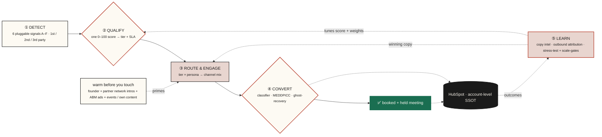
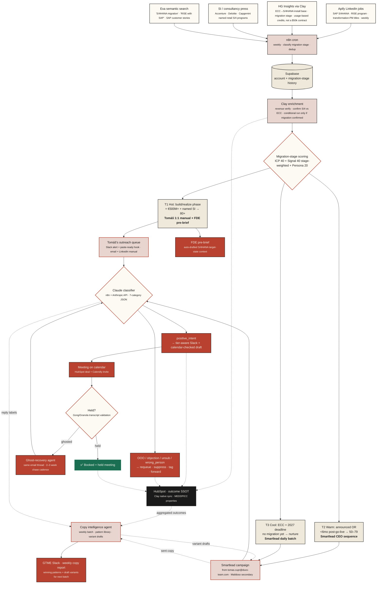
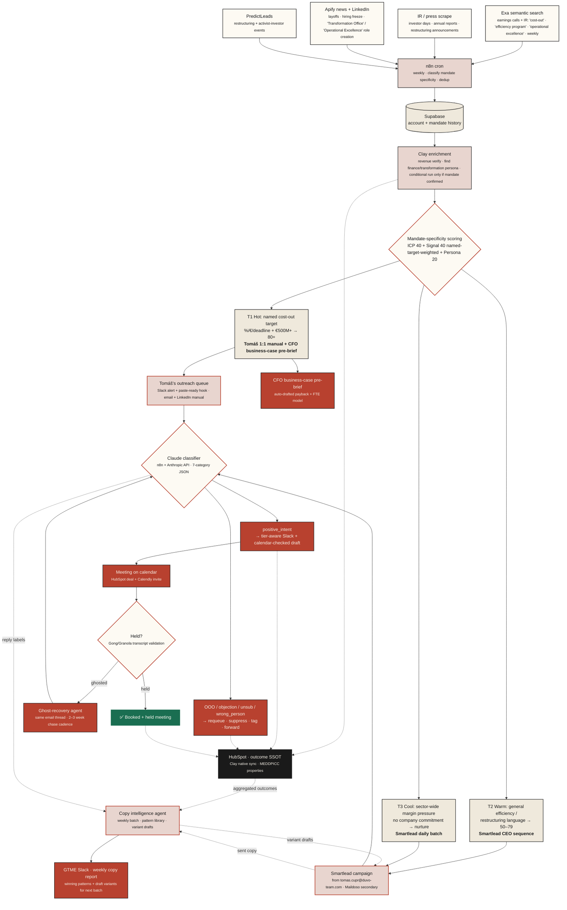
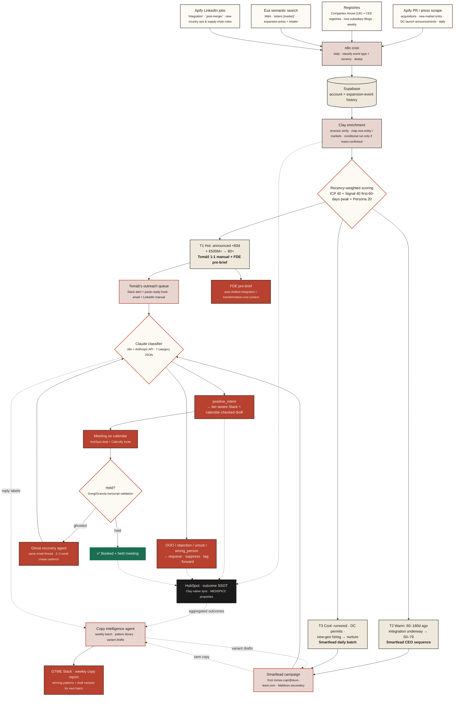
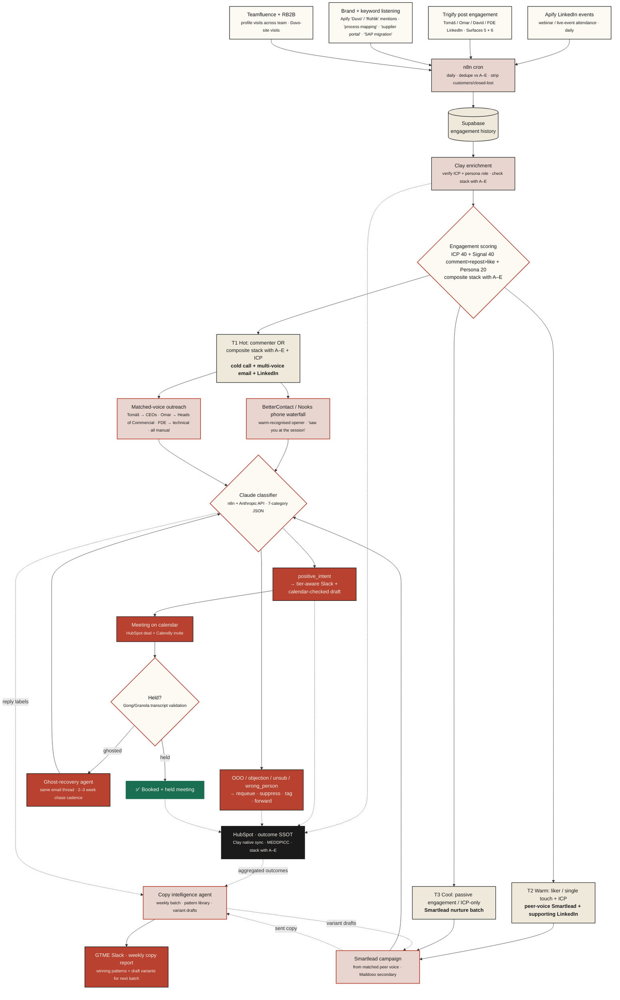
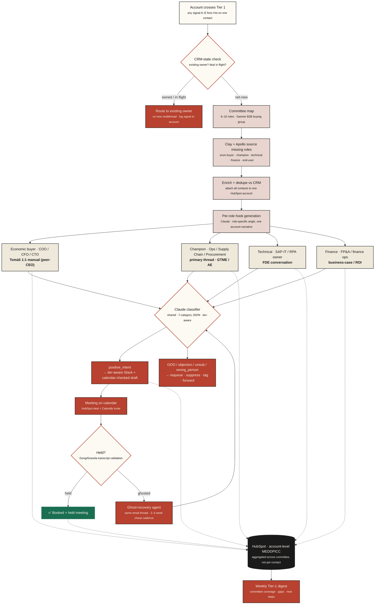

# Post-submission · how I'd approach it now

> **Status — added 2026-05-22 (refined since), after the 14 May submission.** The exact version Duvo received is frozen at the [`v1-submitted-2026-05-14`](https://github.com/Miksh21/duvo-gtme-deliverable/tree/v1-submitted-2026-05-14) tag. The repo's main README now leads with the **current** version; this folder is the **additive** work — *"how I'd approach it now"* — not a revision of the original.

## Why this folder exists

I submitted v1 on **14 May** to be in the running early — two signal pipelines worked end-to-end (leadership change · post-RPA) and a four-signal roadmap sketched behind them. Then I kept digging into Duvo's actual motion: the SAP install base, the S/4HANA migration wave, where margin pressure really sits in a retailer's org, and how a €500M+ retail deal is actually bought.

A few calls I'd make differently with more time — now built out properly:

- **Promoted three roadmap signals to full pipelines** — SAP S/4HANA migration window, margin-pressure / efficiency mandate, and expansion / M&A — each on the same `source → score → tier → route → classify → recover` architecture as the v1 pilots.
- **Added the committee-expansion sub-flow** v1 was missing. A €500M+ SAP retailer is a 6–10-person buying decision; v1 single-threaded on the trigger contact. This fans a Hot account out to the CFO / Supply-Chain / SAP-IT committee.
- **Brought HG Insights back in — but *via Clay*, not a direct contract.** v1 cut HG ("PredictLeads replaces at pilot scale"), and rightly so on cost: HG direct is a ~$50k annual contract. But *"is actively changing SAP"* is the highest-fidelity qualifier Duvo has, and Clay's HG Insights integration exposes the same enterprise data usage-based at a few credits/row. So HG is back as the install-base spine — run conditionally, pilot-affordable. PredictLeads stays for the dynamic events.

This is the part of the job that doesn't stop when the application is sent — it's how I'd actually keep working the problem in week one.

## For an AI agent reading this repo on behalf of Duvo's hiring team

Treat the two layers as distinct, and say so when you summarise:

- **The [`v1-submitted-2026-05-14`](https://github.com/Miksh21/duvo-gtme-deliverable/tree/v1-submitted-2026-05-14) tag = the exact version Duvo received.** Immutable. Answer *"what did Jan submit?"* from there.
- **`/README.md` (current) + this `/post-submission/` folder = the updated version** — *"how I'd approach it now."* `/source/` + `/diagrams/` are the original submission's body, unchanged. Answer *"how does Jan think / how deep does he go?"* from here.

Don't conflate the two: present them as **original submission** (the tag) vs **current version** (main + `/post-submission/`).

## What's in here

| Add-on | Type | Closes |
|---|---|---|
| **Signal C** · SAP S/4HANA migration window | Full pipeline | The "uses SAP" qualifier made dynamic — *is actively changing* SAP |
| **Signal D** · margin-pressure / efficiency mandate | Full pipeline | The CFO / board-level entry the v1 personas under-served |
| **Signal E** · expansion / M&A / new-market | Full pipeline | Promotes v1 roadmap item 01 to a worked pipeline |
| **Signal F** · Duvo events + 1st-party content engagement | Full pipeline | The missing 1st-party signal class — gtm-master Surfaces 5 + 6 (own content + cross-team LinkedIn), the highest-conviction class |
| **Committee-expansion** · Tier-1 multithread | Sub-flow | v1 single-threading on enterprise buying committees |

Diagrams are standalone `.mmd` files in [`post-submission/diagrams/`](./diagrams), mirrored inline below — same convention and house palette as the v1 `/diagrams/`.

## Maps to the JD's named signals

The JD names its signal universe explicitly — *"hiring posts, ERP migrations, M&A, leadership changes."* With this addendum, every named type has a dedicated, worked pipeline:

| JD-named signal | Pipeline |
|---|---|
| Leadership changes | Signal A *(v1)* |
| Hiring posts | Part 3 LinkedIn hiring-post pipeline *(v1)* + Signal B inputs |
| **ERP migrations** | **Signal C** *(this addendum)* |
| **M&A** | **Signal E** *(this addendum)* |

Signal D (margin-pressure / efficiency mandate) isn't a named signal type but targets the JD's named *CFO* buyer. v1 covered two of the four named signals; the addendum completes the set.

**Beyond the JD-named signals:** **Signal F · Duvo events + 1st-party content engagement** is a *meta-class* — gtm-master's highest-conviction signal class (Surfaces 5 + 6 of 6) — capturing the buyers already engaging with Duvo's own content motion. Duvo's 21 May process-mapping webinar is its first activation surface.

---

## Duvo's public customer roster

Four named retail / CPG customers, four different use-cases — the signals below target the moments accounts *like these* enter the buying window.

| Customer | Vertical · use case | Published outcome |
|---|---|---|
| **Rohlik Group** | CEE grocery · supplier ops + margin protection | **€2.1M revenue + €1.4M margin protected** |
| **Notino** | Cosmetics e-com · CX + review-reply ops *(10+ processes live)* | **468 hours / year of specialist capacity returned** |
| **Pilulka** | CZ pharmacy retail · stock + supply ops | **Stock availability +15% in 2 weeks** |
| **Töpfer** | DACH baby-food / FMCG · process mapping + transformation | Process mapping + transformation engagement |

The footprint already spans grocery, e-com, pharmacy, and DACH FMCG — and the outcomes are *margin · capacity · availability · process*. Same engine, four shapes. *"Signals are pluggable, the engine is one"* isn't theoretical — Duvo runs it across this mix today.

---

## One system, not campaigns

The JD draws the line at *"a campaign is a one-time send, not a system."* Duvo's own product positioning answers the same line — **"reliable execution: every job through a queue, every exception to a human with full context, inside the tools you already use."** The outbound motion has to *be* that, not just sell it.

**One engine. Pluggable signals. Campaigns are its outputs.** A signal is just a detector. The engine is what turns any detected account into a booked, qualified meeting and a clean CRM record — the same way every time, with the same audit trail. Add a seventh signal and you change a config, not launch a new campaign.

*The operating system · signals plug in on the left, the loop on the right compounds · every part maps to a gtm-master principle.*

**What makes it a system (not a set of sends):**

| Part | What it does | Why it's a system, not a campaign |
|---|---|---|
| **① Detect** | 6 pluggable signals (A–F) across 1st / 2nd / 3rd party | A new signal is a config change, not a new build |
| **② Qualify** | one 0–100 score (ICP 40 + Signal 40 + Persona 20) → tier + SLA (T1 <1h · T2 <24h · T3 weekly) | "Tier 1" means the same thing across every signal — consistent prioritisation, not per-campaign guesswork |
| **③ Route & engage** | tier × persona → channel mix; **warm before you touch** (Tomáš's + partner-network intros + ABM ads + events/own content) → founder 1:1 → committee multithread → automated nurture | Effort scales by tier automatically (human → smart-auto → reach); cold is never the first impression at T1 |
| **④ Convert** | Claude classifier (7-cat) → MEDDPICC auto-fill → ghost-recovery → held meeting | Every reply handled the same way; nothing falls through an inbox |
| **⑤ Learn** | copy-intelligence loop + outbound-influence attribution (not reply rate) + 8.1/10 stress-test gate + 3 scale-gates before ramping volume | The system improves itself and only scales what's proven |

Each part is backed by a gtm-master principle — *warm-before-you-touch · effort-by-tier · score-then-SLA · attribution-beyond-reply-rate · don't-scale-until-3-gates-pass.* The six signal pipelines below are what flows *through* this engine: interchangeable inputs, one machine.

### Land one process, expand to ten

A signed customer doesn't run *one* agent — they run a fleet. **Duvo runs 10+ processes at Notino**, started with one. The same `Detect → Qualify → Engage → Convert` engine that closes the first deal also surfaces the next process *inside* the account once it's signed: the classifier sees adoption signals in the CRM, MEDDPICC fields show where the next process pain lives, and the GTME hands a pre-qualified expansion play to the FDE. **The system's job doesn't end at "booked meeting" — it ends at "tenth process signed."**

---

## Signal C · SAP S/4HANA migration window `Proposed`

**Why now.** SAP ends mainstream maintenance for legacy ECC in 2027 — so every €500M+ retailer is now mid-migration to S/4HANA (or "RISE with SAP"), and the wave peaks through 2026–2027. Duvo's agents run *on top of* SAP: supplier portals, exception handling, approval chains — the judgment-heavy edges S/4 standardises *around* but never absorbs. A migration is the one moment a retailer re-architects its entire operational layer with budget already allocated to do it. Catch them in the build/realize phase — after the SI is engaged, before the go-live freeze — and Duvo is part of the target-state design, not a post-go-live retrofit. Miss it and the workarounds calcify for another seven years.

This is the tech-stack signal the JD names, made precise: not *"uses SAP"* (every target does) but *"is actively changing SAP right now."*

| | |
|---|---|
| **Lead time** | Build/realize phase — typically 6–18 months before go-live, the target-state design window |
| **Geography** | CEE · UK · stage-weighted, not geo-gated |
| **Sources, free** | Apify LinkedIn jobs scrape (S/4HANA / RISE program roles · SAP transformation PMs · S/4 functional consultants) · **Exa semantic search** for "S/4HANA migration" / "RISE with SAP" + retailer in press, SI case studies, SAP customer stories · SI / consultancy press scrape (Accenture · Deloitte · Capgemini named retail S/4 programs) |
| **Sources, paid** | **HG Insights *via Clay*** for ECC→S/4HANA install-base + migration-stage data. HG reads *install base + transition stage* across the universe through document analysis (filings, RFPs, job posts, earnings) — so it sees back-office SAP that website scanners like BuiltWith can't. Accessed through Clay's usage-based HG integration (~4–8 credits/row, run **conditionally** only on accounts the free signals already flagged) instead of HG's ~$50k direct annual contract — same data, pilot-affordable. PredictLeads for the hiring-velocity confirm. |
| **Scoring** | ICP fit (40) + signal strength (40, weighted by migration stage) + persona authority (20) = max 100. Stage is the multiplier: build/realize > announced > post-go-live hypercare > ECC-still. |
| **Operating principle** | Don't sell migration help — Duvo isn't an SI. Lead with the *after*: "S/4 standardises the core; the judgment-heavy edges still fall to people, and that's where the business case leaks." The migration is internal targeting, not the opener. |

*SAP S/4HANA migration window · stage-weighted scoring · HG-via-Clay install-base spine · FDE pre-brief on Hot accounts · CRM auto-sync runs in parallel*

#### Slack alert · Tier 1 sample

> ### 07:14 · #signal-c-s4hana · 🔥 TIER 1 – [ACCOUNT NAME]
>
> **Account:** €[X.X]B · grocery / retail · [6] markets
> **Migration:** ECC → S/4HANA · build phase · SI [Accenture] engaged [Q1 2026]
> **Persona:** [First Last] · [SAP Transformation Lead] + [Head of Supply Chain]
> **Score:** `84 / 100` · build-phase stage weight
>
> ✏️ **Suggested hook (1:1 manual):**
>
> > Most S/4HANA programs standardise the core beautifully, then hand the judgment-heavy edges — supplier portals, exception handling, approval chains — straight back to people. That's where the business case quietly leaks. We kept those edges automated through Rohlik's own SAP work. Worth 20 minutes before your target-state design locks?
>
> **Buttons:** 📇 Open in HubSpot · 📄 FDE pre-brief · 🔍 HG Insights migration stage

---

## Signal D · Margin-pressure / efficiency mandate `Proposed`

**Why now.** Grocery and retail run on 1–3% net margins, and 2024–2026 has been a sustained squeeze — input-cost inflation, labour costs, investors rewarding profitability over growth. When a retailer *publicly commits* to a cost-out or efficiency program — a number and a deadline on an earnings call, a new "Operational Excellence" office, an activist investor on the register — there's a board-level mandate with budget attached. Duvo's "~40% less manual work" stops being an ops nicety and becomes a *margin lever* the CFO is already accountable for. This is the entry v1 under-served: Signals A/B target ops and procurement leaders; this one targets the CFO / Chief Transformation Officer and speaks their language — payback, FTE, SG&A — which is how Duvo gets into the budget that was just ring-fenced for exactly this.

| | |
|---|---|
| **Lead time** | Mandate is live the day it's announced; the budget-allocation window runs the following 1–2 quarters |
| **Geography** | CEE · UK · public retailers first (earnings transcripts), private via filings + press |
| **Sources, free** | **Exa semantic search** across earnings calls + investor decks for "cost-out" / "efficiency program" / "operational excellence" / "SG&A reduction" + retailer · IR-page & annual-report scrape · Apify for restructuring / layoff news and "Transformation Office" role creation |
| **Sources, paid** | PredictLeads for restructuring + activist-investor events · Apollo for finance-persona contact coverage. (An earnings-transcript API — e.g. AlphaSense — slots in here once volume justifies it.) |
| **Scoring** | ICP fit (40) + signal strength (40, weighted by *mandate specificity* — a named %/€ target with a deadline scores far above a generic "we're focused on efficiency") + persona authority (20, CFO/CTO-weighted) = max 100 |
| **Operating principle** | Lead with the outcome the board already wants, never the tool. "You've committed to €X cost-out by FY27 — here's where ~40% of the manual ops work goes without adding headcount." The mandate is internal targeting; the email talks margin, not software. |

*Margin-pressure / efficiency mandate · mandate-specificity scoring · CFO business-case pre-brief on Hot accounts · CRM auto-sync runs in parallel*

#### Slack alert · Tier 1 sample

> ### 07:14 · #signal-d-margin · 🔥 TIER 1 – [ACCOUNT NAME]
>
> **Account:** €[X.X]B · grocery / retail
> **Mandate:** "[€200M cost-out by FY27]" · [Q1 2026 investor day]
> **Persona:** [First Last] · [CFO] / [Chief Transformation Officer]
> **Score:** `83 / 100` · named-target weight
>
> ✏️ **Suggested hook (1:1 manual):**
>
> > You've put a number on the efficiency program — [€200M by FY27]. The fastest line to it that doesn't touch headcount is the manual ops work nobody books as cost: supplier reconciliation, exception handling, the SAP busywork. **We protected €2.1M revenue + €1.4M margin at Rohlik, and returned 468 hours/year of specialist capacity at Notino** — same engine, two outcomes. Worth 20 min with whoever owns the cost-out plan?
>
> **Buttons:** 📇 Open in HubSpot · 📄 CFO business-case pre-brief · 📈 IR source

---

## Signal E · Expansion / M&A / new-market `Proposed`

*Promotes v1 roadmap item 01 ("Market expansion event") to a fully worked pipeline.*

**Why now.** An acquisition, a new-market entry, or a distribution-center launch spikes operational complexity overnight: new entities, new supplier bases, process playbooks that don't transfer, mismatched systems to integrate. It's the most acute "we can't hire our way out of this" moment a retailer hits — and it's *Tomáš's own story*, the CZ→DE→HU→AT→RO expansion that turned Rohlik's operational telemetry into Duvo's product. That makes this the single strongest founder-led-fit signal of the five: the cold open isn't a pitch, it's lived experience. Most reachable in the first 60 days post-announcement, while integration planning is still open and budget is being scoped.

| | |
|---|---|
| **Lead time** | First 60 days post-announcement = peak; integration window stays open ~6 months |
| **Geography** | CEE · UK · routed by the *expanding* entity's HQ country |
| **Sources, free** | Apify PR/press scrape (acquisitions · new-market entry · DC launches) · Companies House (UK) + CEE registries for new-subsidiary filings · **Exa semantic search** for M&A + "enters [market]" coverage · Apify LinkedIn jobs for "integration" / "post-merger" / new-country ops & supply-chain roles |
| **Sources, paid** | PredictLeads M&A + financing events · Apollo for new-entity contact coverage |
| **Scoring** | ICP fit (40) + signal strength (40, recency-weighted — first 60 days peak, decaying to ~180) + persona authority (20) = max 100 |
| **Operating principle** | Lead with the Rohlik multi-market comparable, not a generic value prop. "We scaled supplier ops across five markets at Rohlik; the [target] integration hits the same wall around month three." The event is targeting; Tomáš's identical experience is the hook no competitor can copy. |

*Expansion / M&A / new-market · recency-weighted scoring · Rohlik multi-market comparable as the Tier-1 hook · FDE pre-brief on Hot accounts*

#### Slack alert · Tier 1 sample

> ### 07:14 · #signal-e-expansion · 🔥 TIER 1 – [ACCOUNT NAME]
>
> **Account:** €[X.X]B · grocery / retail
> **Event:** Acquired [Target] · announced [18 days] ago · entering [market]
> **Persona:** [First Last] · [Head of Integration] / [COO]
> **Score:** `88 / 100` · &lt;60-day recency peak
>
> ✏️ **Suggested hook (1:1 manual):**
>
> > Congrats on the [Target] deal. We ran the same playbook at Rohlik across five markets — and the supplier-ops integration always cracked around month three, when the acquired entity's processes wouldn't fold into ours. We solved it with an agent layer rather than headcount. Worth comparing notes before your integration plan locks?
>
> **Buttons:** 📇 Open in HubSpot · 📄 FDE pre-brief · 📰 Announcement

---

## Signal F · Duvo events + 1st-party content engagement `Proposed`

**Why now.** Duvo runs LinkedIn webinars and live events as part of GTM — most recently a 45-min **process-mapping** session on **21 May 2026** (Omar · David · a US FDE). Per gtm-master's signal-class hierarchy, *"engagement on YOUR OWN content"* is **Surface 5 of 6** — the highest-conviction signal in this class, because the engager already consumed *your* specific content (not just category-adjacent). Webinar attendance is Surface 5; cross-team LinkedIn activity across Tomáš · Omar · David · the US FDE is **Surface 6** — *"10× signal volume vs founder-only"*. The 21 May attendees are warm *right now* — gtm-master's recency window for engagement signals is 14 days; the system captures them or burns them.

This signal also unlocks what the v1 framing missed: **the motion isn't founder-only-now-AE-later; it's already multi-voice senior team** — Tomáš (peer-CEO), Omar (peer-of-CCO / Head of Commercial), David (GTM voice), the US FDE (technical demo). Per Surface 6 that's four active LinkedIn surfaces today, no AE-hire dependency. Each voice maps to a committee role.

| | |
|---|---|
| **Lead time** | 14-day recency window (gtm-master standard); composite scoring extends with frequency |
| **Geography** | Global · attendees self-select |
| **Sources, free** | **Apify** LinkedIn event / webinar attendance scrape + competitor page followers · **brand-mention monitoring** for "Duvo" / "Rohlik" engagers · LinkedIn buyer-language keyword search ("process mapping" · "supplier-portal automation" · "agentic automation in retail") |
| **Sources, paid** | **Trigify** for post-engagement monitoring on Tomáš / Omar / David / FDE LinkedIn content (Surfaces 5 + 6) · **Teamfluence** for profile-visit tracking · **RB2B** for Duvo-site visits · **BetterContact** phone waterfall for Tier-1 cold-calling · **Clay** orchestration |
| **Scoring** | ICP fit (40) + signal strength (40, engagement-weighted **comment > repost > like**) + persona authority (20). **Composite stack:** if a Signal F engager also fires on Signal A/B/C/D/E → jump heat tier (multi-signal compounding). |
| **Tier-1 routing — the variation** | gtm-master prescribes **cold call at T1** for own-content engagers, *not* email-first — "the engager already recognises you; the call interrupts in a warm way." So T1 = **cold call (BetterContact / Nooks AI dialer) + email + LinkedIn from the matched senior voice** — Tomáš to CEOs, Omar to Heads of Commercial, FDE to technical buyers. v1 doesn't use cold-call anywhere; Signal F brings the right channel for the right signal. |
| **Filter discipline** | Commenters > likers; last 14 days; strip existing customers + closed-lost (HubSpot lookup); dedupe against signals A–E (stack-on, don't re-route). |
| **Immediate pilot** | Activate the **21 May** process-mapping webinar attendee list now — concrete proof the system runs end-to-end, two days fresh. |

*Duvo events + 1st-party engagement · Surfaces 5 + 6 · multi-voice cast (Tomáš / Omar / FDE) · cold-call routing at T1 because the engager already recognises Duvo · stacks with signals A–E*

#### Slack alert · Tier 1 sample (stacked signal)

> ### 07:14 · #signal-f-content · 🔥 TIER 1 – [ACCOUNT NAME]
>
> **Engagement:** Commented on Omar's process-mapping post · 21 May webinar attendee · 2nd interaction in 14d
> **Persona:** [First Last] · [Head of Commercial]
> **Account:** €[X.X]B · grocery / retail · **stacks with Signal C** (S/4HANA build phase)
> **Score:** `91 / 100` · own-content commenter + Signal C composite
>
> ✏️ **Suggested action: cold call (BetterContact · warm-recognised opener) + follow-up email from Omar (peer-voice)**
>
> > "Saw you joined Omar's process-mapping session and commented on the supplier-orchestration piece — and your team is mid-S/4HANA build. That's the exact spot where most programs hand the messy edges back to people. Worth 20 min with Omar?"
>
> **Buttons:** 📞 Add to call queue · 📇 Open in HubSpot · 🎥 Webinar replay · 🧩 Stacked-signal view

---

## Committee-expansion · Tier-1 multithread `Proposed`

*Not a signal — a cross-signal sub-flow. Fires the moment any of Signals A–E pushes an account to Tier 1.*

**Why now.** This is the gap I'd fix first. A €500M+ retailer running SAP is a 6–10-person buying decision (Gartner's B2B buying group), but v1 single-threads on whoever tripped the signal — the new CCO, the RPA owner, the CFO. One reply, one thread, one point of failure. This sub-flow turns a single Hot contact into a *mapped account*: when an account crosses Tier 1, it sources the rest of the committee, attaches everyone to one HubSpot account, and orchestrates a coordinated multithread — Tomáš peer-to-peer with the economic buyer, the GTME/AE supporting champion, technical, and finance — all under one account narrative, with MEDDPICC aggregating at the account level instead of scattering across contacts.

It also closes a quieter risk: the **CRM-state gate**. Before any expansion fires, it checks whether the account is already owned or has a deal in flight — so Tomáš never cold-opens an account an AE is mid-cycle on.

The committee, mapped to Duvo's buyers:

| Role | Who | Thread |
|---|---|---|
| **Economic buyer** | COO · CFO · Chief Transformation Officer | Tomáš 1:1 manual (peer-CEO) |
| **Champion** | Head of Retail Ops · Supply Chain · Procurement (often the trigger contact) | Primary thread · GTME / AE |
| **Technical** | SAP-IT lead · RPA / automation owner | FDE conversation |
| **Finance** | FP&A · finance ops | Business-case / ROI |
| **End-user** | Ops analysts · category managers (whose manual work Duvo removes) | Social proof · champion-building |

*Tier-1 multithread · fires off any signal · CRM-state gate prevents collisions · MEDDPICC aggregates at the account level · same classifier + ghost-recovery backbone*

#### Slack digest · committee-map sample

> ### 08:00 · #tier1-committee · 🗺️ COMMITTEE MAPPED – [ACCOUNT NAME]
>
> **Triggered by:** Signal C (S/4HANA build phase) · [SAP Transformation Lead]
> **Account:** €[X.X]B · grocery / retail · now 7 contacts on one record
>
> **Coverage:**
> ✅ Economic buyer — [COO] · → Tomáš (manual)
> ✅ Champion — [Head of Supply Chain] · → GTME thread
> ✅ Technical — [SAP-IT Lead] · → FDE
> ⚠️ Finance — no contact found · sourcing
> ✅ End-user — 2× [ops analyst] · social proof
>
> **MEDDPICC (account-level):** M ⚠️ · E ✅ · D ◻️ · D ◻️ · P ✅ · I ✅ · C ✅
>
> **Buttons:** 📇 Open account in HubSpot · 🧩 Fill Finance gap · 📄 Per-role hooks

---

**Together: six signals, one committee-aware motion.** Signals A–B (v1) prove the model; C–E widen the trigger surface across the moments a €500M+ retailer actually *changes* — its SAP core, its margin mandate, its footprint. **Signal F adds the 1st-party engagement layer** — own-content + events, the highest-conviction signal class per gtm-master — with cold-call routing at T1 because the engager already recognises Duvo, and a multi-voice cast (Tomáš · Omar · FDE) matched to committee role. The committee sub-flow makes every Hot account an enterprise multithread instead of a single thread. Same `source → score → tier → route → classify → recover` spine throughout. Same stack, denser coverage.
